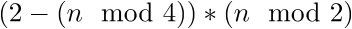
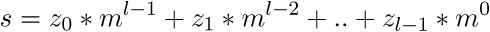
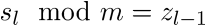

# ASIS CTF Quals 2015: simple algorithm

----------
## Challenge details
| Contest        | Challenge     | Category  | Points |
|:---------------|:--------------|:----------|-------:|
| ASIS CTF Quals 2015 | simple algorithm | Crypto |    100 |

**Description:**
>*The flag is encrypted by this code, can you decrypt it after finding the system?*

----------
## Write-up
### First look

We are presented with a ciphertext file enc.txt and the following encoding algorithm:

>```python
>flag = '[censored]'
>hflag = flag.encode('hex')
>iflag = int(hflag[2:], 16)
>
>def FAN(n, m):
>    i = 0
>    z = []
>    s = 0
>    while n > 0:
>    	if n % 2 != 0:
>    		z.append(2 - (n % 4))
>    	else:
>    		z.append(0)
>    	n = (n - z[i])/2
>    	i = i + 1
>    z = z[::-1]
>    l = len(z)
>    for i in range(0, l):
>        s += z[i] * m ** (l - 1 - i)
>    return s
>
>i = 0
>r = ''
>while i < len(str(iflag)):
>    d = str(iflag)[i:i+2]
>    nf = FAN(int(d), 3)
>    r += str(nf)
>    i += 2
>
>print r 
>```

As we can see the flag gets converted to hex representation and then to an integer (there seems to be a mistake in the implementation effectively chopping off the first character of the flag due to hflag[2:] which was probably meant to chop off the prefix of hex() but since .encode('hex') is used this doesn't apply). The resulting integer is treated as a string and every 2-digit block is pulled through the FAN encoding routine and appended to the ciphertext string.

Let's start by inverting the FAN routine. The FAN routine consists of two parts, one generating a sequence:

>```python
>    while n > 0:
>        if n % 2 != 0:
>            z.append(2 - (n % 4))
>        else:
>            z.append(0)
>        n = (n - z[i])/2
>        i = i + 1
>    z = z[::-1]
>```

which is of the form:



And is used in the following polynomial equation to yield s:

>```python
>    l = len(z)
>    for i in range(0, l):
>        s += z[i] * m ** (l - 1 - i)
>    return s
>```

which is of the form:



Hence we know:



We can then subtract this remainder, divide by m and repeat to invert the FAN transformation and reconstruct the input n. Since we have to apply this to all elements that compose the ciphertext, we need to find a way to split it into the original segments correctly which is complicated by the fact that FAN can, for m = 3, output numbers from 1 to 4 digits. We can do this by using a greedy approach enumerating the range of FAN for the proper domain (byte-values 0x00 to 0xFF) and for each offset, try to see if a slice of size 4 would yield a value in the range of FAN, if not try size 3, etc. In this fashion we can re-segment the encoded string and DEFAN the resulting array to [obtain the flag](solution/simple_crack.py):

>```python
>#!/usr/bin/python
>#
># ASIS CTF Quals 2015
># simple algorithm (CRYPTO/100)
>#
># @a: Smoke Leet Everyday
># @u: https://github.com/smokeleeteveryday
>#
>
># FAN encoding routine
>def FAN(n, m):
>    i = 0
>    z = []
>    s = 0
>    while n > 0:
>        if n % 2 != 0:
>            z.append(2 - (n % 4))
>        else:
>            z.append(0)
>        n = (n - z[i])/2
>        i = i + 1
>    z = z[::-1]
>    l = len(z)
>    for i in range(0, l):
>        s += z[i] * m ** (l - 1 - i)
>    return s
>
># Inverse of FAN encoding routine
>def DEFAN(s, m):
>    z = []
>    while(s != 0):
>        zi = s % m
>        if(zi == 2):
>            zi = -1
>
>        z.append(zi)
>        s -= zi
>        s /= m
>    z = z[::-1]
>    for i in xrange(len(z)):
>        if(i == 0):
>            n = z[i]
>        else:
>            n = 2*n + z[i]
>    return n
>
># Decrypt re-segmented ciphertext
>def decrypt(r, m):
>    q = ''
>    for i in xrange(0, len(r)):
>        d = str(DEFAN(long(r[i]), m))
>        if((len(d) < 2) and (i != (len(r)-1))):
>            d = '0'+d
>        q += d
>    return hex(long(q))[2:-1].decode('hex')
>
># All possible values for FAN encoding routine
>def getR(m):
>    R = []
>    for i in xrange(0, 100):
>        d = str(i)
>        if(len(d) < 2):
>            d = '0'+d
>
>        q = FAN(int(d), m)
>        R.append(q)
>    return R
>
># Re-segment encoded string based on greedy approach
>def segment(e, m):
>    R = getR(m)
>    offset = 0
>    s = []
>    while(offset < len(e)):
>        for i in xrange(4, 0, -1):
>            chunk = e[offset: offset+i]
>            if(long(chunk) in R):
>                s.append(chunk)
>                offset += i
>                break
>    return s
>
>m = 3
>eflag = open("enc.txt", "rb").read()
>
>print "[+]Got flag: [%s]" % decrypt(segment(eflag, m), m)
>```

Which produces the following output:

>```bash
>$ ./simple_crack.py
> [+]Got flag: [SIS{a9ab115c488a311896dac4e8bc20a6d7}]
>```

