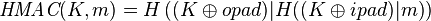
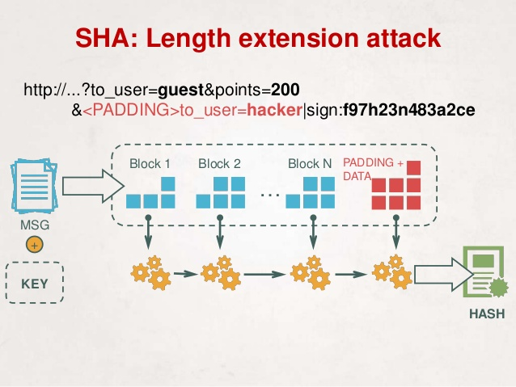

# Teaser CONFidence CTF 2015: Mac Hacking

----------
## Challenge details
| Contest        | Challenge     | Category  | Points |
|:---------------|:--------------|:----------|-------:|
| Teaser CONFidence CTF 2015 | Mac Hacking | Crypto |    150 |

**Description:**
>*They laughed at my XOR encryption. Then, they mocked me for using MD5. Hah! What do they even know. I bet they don't even code in PHP.*

>*Oh, so you think you're clever, too? Well then, Master Hacker, show me your mad skillz. Here, [I'll even give you the source code](challenge/index.php). Go ahead, make my day.*

>*Alright, alright, there's an easier way to solve this one than we expected. The task is now worth 150 points.*

----------
## Write-up
### First look

The application is a simple HMAC (Hash-based Message Authentication) signing service and our goal is to trick it into signing data containing the string "get flag". The application supports two actions: sign and verify. The problem here is that it doesn't allow us to sign any data containing the string "get":

>```php
>   if (strstr($data,'get')) {
>      die('get word not allowed');
>   }
>```

If we look at the signing code we can see it can be performed in 'old' or new mode:

>```php
>   if ($method == 'old') {
>      echo md5(do_xor($data,$secret));
>   } else {
>      echo hash_hmac('md5',$data, $secret);
>   }
>```

The 'new' mode returns an MD5-based HMAC of our data with the secret key. The 'old' mode, however, returns the MD5 hash of a xor of our data with the secret key, performed as follows:

>```php
>function do_xor($a,$b) {
>  $s = '';
>  for ($i=0; $i < max(strlen($a),strlen($b)); $i++) {
>    $x = $i < strlen($a) ? ord($a[$i]) : 0;
>    $y = $i < strlen($b) ? ord($b[$i]) : 0;
>    $s .= chr($x ^ $y);
>  }
>  return $s;
>}
>```

The above function performs a character-by character xor of two strings, effectively padding the shorter one with nullbytes to the length of the larger one.

----------
### The vulnerability

Let's look at how HMACs are defined and implemented:



Where:

>*H is a cryptographic hash function,*

>*K is a secret key padded to the right with extra zeroes to the input block size of the hash function, or the hash of the original key if it's longer than that block size,*

>*m is the message to be authenticated,*

>*opad is the outer padding (0x5c5c5c…5c5c, one-block-long hexadecimal constant),*

>*and ipad is the inner padding (0x363636…3636, one-block-long hexadecimal constant).*

In python it would be implemented as follows:

>```python
>from hashlib import md5
> 
>trans_5C = bytearray((x ^ 0x5c) for x in range(256))
>trans_36 = bytearray((x ^ 0x36) for x in range(256))
>blocksize = md5().block_size # 64
> 
>def hmac_md5(key, msg):
>    if len(key) > blocksize:
>        key = md5(key).digest()
>    key = key + bytearray(blocksize - len(key))
>    o_key_pad = key.translate(trans_5C)
>    i_key_pad = key.translate(trans_36)
>    return md5(o_key_pad + md5(i_key_pad + msg).digest())
>```

So that means if we can obtain o_key_pad and md5(i_key_pad + msg) seperately we can reconstruct the corresponding HMAC ourselves.

Given that we can obtain the md5 of our secret xored with an arbitrary string, we can use the old signing method to effectively obtain md5(i_key_pad + msg) if we make it sign:

>md5(do_xor("\x36"*blocksize + msg, secret)) = md5(i_key_pad + msg)

If we can obtain x = md5(i_key_pad + msg) where msg includes "get flag" we can subsequently do the same to obtain md5(o_key_pad + x). Since we can't include the word "get" in our data, either for old or new signing, we will have to exploit the fact that md5(i_key_pad + msg) is effectively a so-called "secret prefix" MAC based on a Merkle–Damgård construction hash (MD5 in this case) which is vulnerable to a [length-extension attack](en.wikipedia.org/wiki/Length_extension_attack).

In short, the digest that comes out of a Merkle–Damgård hash is the final state of a sequence of internal states. If, however, we reconstruct the internal state from this final state we can continue processing data, effectively appending it to our input resulting in us obtaining md5(i_key_pad + msg + attack_junk + arbitrary_message):



HMACs themselves aren't vulnerable to length extension attacks but our ability to obtain an MD5 hash of the XOR of the secret with arbitrary data allows us to effectively 'weasel' our length extension attack into the HMAC construction. This does show why it can be very dangerous to maintain backwards compatible functionality in a protocol.

In order to automate our length extension attack we used [HashPump's python bindings](https://github.com/bwall/HashPump) to get the [following code](solution/machack_crack.py):

>```python
>#!/usr/bin/python
>#
># Teaser CONFidence CTF 2015
># Mac Hacking (CRYPTO/150)
>#
># @a: Smoke Leet Everyday
># @u: https://github.com/smokeleeteveryday
>#
>
>import requests
>import hmac
>from hashlib import md5
>from urllib import urlencode
>import hashpumpy
>
>blocksize = md5().block_size
>
>def visit(url, encoded_args):
>   r = requests.get(url + "?" + encoded_args)
>   return r.text.strip()
>
>def oldSign(url, data):
>   args = {'a': 'sign',
>           'm': 'old',
>           'd': data}
>   return visit(url, urlencode(args))
>
>def newVerify(url, data, signature):
>   args = {'a': 'verify',
>           'm': 'new',
>           'd': data,
>           's': signature}
>   return visit(url, urlencode(args))
>
>url = "http://95.138.166.219/"
>
>base_msg = "ayylmao"
>extend_msg = "get flag"
>
>i_key_md5 = oldSign(url, "\x36"*blocksize + base_msg).decode('hex')
>print "[+]Got md5(i_key_pad + '%s') = %s" % (base_msg, i_key_md5.encode('hex'))
>
>res = hashpumpy.hashpump(i_key_md5.encode('hex'), base_msg, extend_msg, blocksize)
>i_key_md5_extend = res[0]
>forged_msg = res[1]
>
>print "[+]Got md5(i_key_pad + '%s') = %s" % (forged_msg, i_key_md5_extend)
>
>o_key_md5 = oldSign(url, "\x5C"*blocksize + i_key_md5_extend.decode('hex'))
>
>print "[+]Got md5(o_key_pad + md5(i_key_pad + forged_msg).digest()) = %s" % o_key_md5
>print "[+]Verification response: [%s]" % newVerify(url, forged_msg, o_key_md5)
>```

Running it produces the following output:

>```bash
>$ ./machack_crack.py
>[+]Got md5(i_key_pad + 'ayylmao') = a1b933f11d893408fb93c1a9d5348a2a
>[+]Got md5(i_key_pad + 'ayylmao€8get flag') = 5a6ac3f7c8df68ddf2e0ba6c0a448239
>[+]Got md5(o_key_pad + md5(i_key_pad + forged_msg).digest()) = af76d619506d81117ed80fa8a6d9fb9a
>[+]Verification response: [DrgnS{MyHardWorkByTheseWordsGuardedPleaseDontStealMasterCryptoProgrammer}]
>```

Giving us the flag:

>DrgnS{MyHardWorkByTheseWordsGuardedPleaseDontStealMasterCryptoProgrammer}