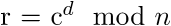

# MMACTF 2015: Signer and Verifier

----------
## Challenge details
| Contest        | Challenge     | Category  | Points |
|:---------------|:--------------|:----------|-------:|
| MMACTF 2015 | Signer and Verifier | Crypto |    100 |

**Description:**
>*Signer: nc cry1.chal.mmactf.link 44815*
>
>*Verifier: nc cry1.chal.mmactf.link 44816*

----------
## Write-up

This challenge consists of two services, a signer and a verifier. When we connect to the verifier we see the following:

```bash
$nc cry1.chal.mmactf.link 44816
n = 167891001700388890587843249700549749388526432049480469518286617353920544258774519927209158925778143308323065254691520342763823691453238628056767074647261280532853686188135635704146982794597383205258532849509382400026732518927013916395873932058316105952437693180982367272310066869071042063581536335953290566509
e = 65537
Sign it!
107108056963926119307653689154379598833550598031154162917162315758527187945122022207634177035686529281496908832607092667606369706299100204708802542148796371841158674597117510610317948171940682385931628021629686
```

As we can se we are presented with an RSA public key (in the form of public modulus n and public exponent e) and a challenge plaintext which we somehow have to sign (presumably with the private key corresponding to this public key). When we connect to the signer we get the following:

```bash
$nc cry1.chal.mmactf.link 44815
1234
126500963383535523362422924813570198504368489400746397031182274029742549857996545699890486143555204412107191370721377288720744197999437743673395598519189494683098886868733633814783755962191762295825481720826404197724774063414955423222607128807811029259753833850658565679707331824250463952223440882461917812348
```

This seems to be a signing oracle (no doubt using the private key corresponding to the public key, which is static, used by the verifier) so what's the problem? Well when we pass on a challenge plaintext of the kind given to us by the verifier we get the following:

```bash
$nc cry1.chal.mmactf.link 44815
107108056963926119307653689154379598833550598031154162917162315758527187945122022207634177035686529281496908832607092667606369706299100204708802542148796371841158674597117510610317948171940682385931628021629686
By the way, I'm looking forward to the PIDs subsystem of cgroups.
```

Whereas when we remove or add a single digit to the challenge we get this:

```bash
$nc cry1.chal.mmactf.link 44815
10710805696392611930765368915437959883355059803115416291716231575852718794512202220763417703568652928149690883260709266760636970629910020470880254214879637184115867459711751061031794817194068238593162802162968
147655036597293305287412005777140278249802003939555937089164172422310997238414653941169425568992363729759130379274714704315657478726728732183172990345255790708296252563573275504637254440529890445790003642491465123813432002198838829323949088590667753148114497616813091973209149042178462665092221125938589873673
$nc cry1.chal.mmactf.link 44815
1071080569639261193076536891543795988335505980311541629171623157585271879451220222076341770356865292814969088326070926676063697062991002047088025421487963718411586745971175106103179481719406823859316280216296861
40554833205541852225538783096022884952816938532401725134569154194659158764593741588110294682715910408307274670446470709602661473087620769030150896852818609348118003071968920399236599352135542152945975313345289167077791643988714019511932253264580928444962319227704772912629620902511461638494295201551941416248
```

Looks like our signing oracle won't sign challenges of the size provided to us by the verifier. Not to worry, however. Assuming this is plain, unpadded RSA we can use RSA's malleability property to bypass this check. Given that signing a challenge with an RSA private key is simply modular exponentiation with the private exponent it looks like this:



And given that modular exponentiation distributes over modular multiplication this gives us:


Hence we can trivially divide our challenge by a number n (provided it is in itself considered valid for signing and the challenge is a multiple of it), say 2, sign it and sign the quotient seperately, multiply them and apply modular reduction with the public key's modulus and hence forge the signature. [The following script](solution/forge.py) automates this:

```python
#!/usr/bin/python
#
# MMACTF 2015
# signerverifier (CRYPTO/100)
#
# @a: Smoke Leet Everyday
# @u: https://github.com/smokeleeteveryday
#

from pwn import *

# Have our data of choice signed by the signer
def do_sign(sign_this, sign_port):
	h_sign = remote(host, sign_port, timeout = None)
	h_sign.sendline(str(sign_this))
	lines = h_sign.recv(1024).split("\n")
	h_sign.close()
	return long(lines[len(lines)-2])

host = 'cry1.chal.mmactf.link'
sign_port = 44815
verify_port = 44816

# Open connections
h_verify = remote(host, verify_port, timeout = None)
lines = h_verify.recv(1024).split("\n")

# Fetch public key
n = long(lines[0][4:])
e = long(lines[1][4:])

# Obtain our challenge plaintext
plaintext = long(lines[len(lines)-2])

# Find proper divisor, the lazy way
divisor = 2
for i in xrange(2, 100):
	if(plaintext % divisor == 0):
		break

assert(plaintext % divisor == 0)

# Divide, sign seperately
signed_0 = do_sign(plaintext / divisor, sign_port)
signed_1 = do_sign(divisor, sign_port)

# Apply modular reduction over product of signed parts to obtain signed product
signed = (signed_0 * signed_1) % n

# Send signature
h_verify.sendline(str(signed))

# Retrieve flag
print h_verify.recv(1024)

h_verify.close()
```

Which gives the following output:

```bash
$forge.py 
[+] Opening connection to cry1.chal.mmactf.link on port 44816: Done
[+] Opening connection to cry1.chal.mmactf.link on port 44815: Done
[*] Closed connection to cry1.chal.mmactf.link port 44815
[+] Opening connection to cry1.chal.mmactf.link on port 44815: Done
[*] Closed connection to cry1.chal.mmactf.link port 44815
MMA{homomorphic_challengers}

[*] Closed connection to cry1.chal.mmactf.link port 44816
```

## Solution
`MMA{{homomorphic_challengers}`
