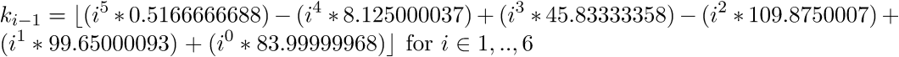
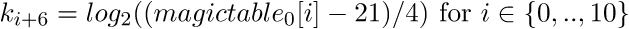
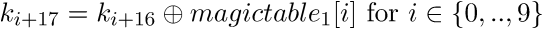

# PoliCTF 2015: johnthepacker

----------
## Challenge details
| Contest        | Challenge     | Category  | Points |
|:---------------|:--------------|:----------|-------:|
| PoliCTF 2015 | johnthepacker | Reversing |    350 |

**Description:**
>*John's greatest skill is to [pack everything and everywhere](challenge/topack) with everyone. He doesn't want that someone reverse his super secret program. So he wrote a magic packing system. Can you show to John that his packing system is not a good anti-reversing solution? 
N.B. Unfortunately John The Packer has multiple solution, so if you have a solution that is not accepted by the scoreboard (but is accepted by the binary) please contact an OP on IRC*

----------
## Write-up

We identify & get pseudocode of the binary

>```bash
>$ file topack
>topack; ELF 32-bit LSB executable, Intel 80386, version 1 (SYSV), dynamically linked (uses shared libs), for GNU/Linux 2.6.32, stripped
>```

The main routine (functions renamed by us) is straightforward:

>```c
>int main_routine()
>{
>  decrypt_and_execute(hidden_func, 83);
>  return 0;
>}
>```

It simply calls a function to decrypt & execute a memory area consisting of 83 DWORDs:

>```asm
>.text:080485E0 decrypt_and_execute proc near           ; CODE XREF: char_check_1+55p
>.text:080485E0                                         ; char_check_0+3Ap ...
>.text:080485E0
>.text:080485E0 arg_0           = dword ptr  8
>.text:080485E0 arg_4           = dword ptr  0Ch
>.text:080485E0
>.text:080485E0                 push    ebp
>.text:080485E1                 mov     ebp, esp
>.text:080485E3                 sub     esp, 8
>.text:080485E6                 mov     eax, [ebp+arg_0]
>.text:080485E9                 and     eax, 0FFFFF000h
>.text:080485EE                 sub     esp, 4
>.text:080485F1                 push    7               ; prot
>.text:080485F3                 push    1000h           ; len
>.text:080485F8                 push    eax             ; addr
>.text:080485F9                 call    _mprotect
>.text:080485FE                 add     esp, 10h
>.text:08048601                 mov     ecx, [ebp+arg_0]
>.text:08048604                 mov     edx, 66666667h
>.text:08048609                 mov     eax, ecx
>.text:0804860B                 imul    edx
>.text:0804860D                 sar     edx, 1
>.text:0804860F                 mov     eax, ecx
>.text:08048611                 sar     eax, 1Fh
>.text:08048614                 sub     edx, eax
>.text:08048616                 mov     eax, edx
>.text:08048618                 mov     edx, eax
>.text:0804861A                 shl     edx, 2
>.text:0804861D                 add     edx, eax
>.text:0804861F                 mov     eax, ecx
>.text:08048621                 sub     eax, edx
>.text:08048623                 mov     edx, off_804A294[eax*4]
>.text:0804862A                 mov     eax, [ebp+arg_0]
>.text:0804862D                 mov     ecx, [ebp+arg_4]
>.text:08048630                 add     esp, 8
>.text:08048633                 push    eax
>.text:08048634                 mov     edx, [edx]
>.text:08048636
>.text:08048636 loc_8048636:                            ; CODE XREF: decrypt_and_execute+5Cj
>.text:08048636                 xor     [eax], edx
>.text:08048638                 add     eax, 4
>.text:0804863B                 dec     ecx
>.text:0804863C                 jnz     short loc_8048636
>.text:0804863E                 pop     eax
>.text:0804863F                 call    eax
>.text:08048641                 sub     esp, 8
>.text:08048644                 push    [ebp+arg_4]
>.text:08048647                 push    [ebp+arg_0]
>.text:0804864A                 call    sub_804859B
>.text:0804864F                 add     esp, 10h
>.text:08048652                 nop
>.text:08048653                 leave
>.text:08048654                 retn
>```

There are two approaches we can take, we can either run the binary in gdb, break on 0x0804863F (the call eax which transfers control to the decrypted memory area) and dump the binary as it is decrypted or we can look up the static keytable and write a IDA patching routine ourselves. We chose the latter approach. We can see the XOR key in the above decryption routine (xor     [eax], edx) is loaded from an address in a pointer table at off_804A294:

>```asm
>.data:0804A294 off_804A294     dd offset unk_8048CE0   ; DATA XREF: sub_804859B+27r
>.data:0804A294                                         ; decrypt_and_execute+43r
>.data:0804A298                 dd offset unk_8048CE5
>.data:0804A29C                 dd offset aB00b         ; "B00B"
>.data:0804A2A0                 dd offset aDead         ; "DEAD"
>.data:0804A2A4                 dd offset unk_8048CF4
>```

Which points to the DWORD-sized key table:

>```asm
>.rodata:08048CE0 unk_8048CE0     db    1                 ; DATA XREF: .data:off_804A294o
>.rodata:08048CE1                 db    2
>.rodata:08048CE2                 db    3
>.rodata:08048CE3                 db    4
>.rodata:08048CE4                 db    0
>.rodata:08048CE5 unk_8048CE5     db  10h                 ; DATA XREF: .data:0804A298o
>.rodata:08048CE6                 db  20h
>.rodata:08048CE7                 db  30h ; 0
>.rodata:08048CE8                 db  40h ; @
>.rodata:08048CE9                 db    0
>.rodata:08048CEA aB00b           db 'B00B',0             ; DATA XREF: .data:0804A29Co
>.rodata:08048CEF aDead           db 'DEAD',0             ; DATA XREF: .data:0804A2A0o
>.rodata:08048CF4 unk_8048CF4     db 0FFh                 ; DATA XREF: .data:0804A2A4o
>.rodata:08048CF5                 db 0FFh
>.rodata:08048CF6                 db 0FFh
>.rodata:08048CF7                 db 0FFh
>```

Giving us the keys: 0x04030201, 0x40302010, 0x42303042, 0x44414544.

We will proceed by decrypting whatever encrypted blobs are present in the binary and reverse them subsequently (if you want to run the modified binary afterwards don't forget to patch out the xor [eax], edx instruction!). Let's first do that with hidden_func which is encrypted with key 0x04030201 giving us, after decryption, the following pseudocode:

>```c
>int __cdecl hidden_func(int a1, int a2, int a3, int a4, signed int a5, int a6)
>{
>  int v6; // ST08_4@4
>  int v7; // ST1C_4@4
>  int v8; // ST08_4@4
>  int v9; // ST1C_4@4
>  int v10; // ST08_4@4
>  int v11; // ST1C_4@4
>  int v12; // ST08_4@4
>  int v13; // ST1C_4@4
>  int v14; // ST08_4@4
>  int v15; // ST1C_4@4
>  int v16; // ST08_4@4
>  int v17; // ST1C_4@4
>  int v18; // ST08_4@4
>  int result; // eax@5
>
>  if ( a5 <= 1 )
>  {
>    printf("Usage:\n %s flag{<key>}\n", *(_DWORD *)a6);
>    exit(0);
>  }
>  v6 = *(_DWORD *)(a6 + 4);
>  v7 = decrypt_and_execute(header_check, 17);
>  v8 = *(_DWORD *)(a6 + 4);
>  v9 = decrypt_and_execute(0x804869A, 17) + v7; // footer_check
>  v10 = *(_DWORD *)(a6 + 4);
>  v11 = decrypt_and_execute(0x80486DE, 23) + v9;// ascii_check
>  v12 = *(_DWORD *)(a6 + 4);
>  v13 = decrypt_and_execute(0x8048A42, 24) + v11;// char_check_0
>  v14 = *(_DWORD *)(a6 + 4);
>  v15 = decrypt_and_execute(0x80489A9, 38) + v13;// char_check_1
>  v16 = *(_DWORD *)(a6 + 4);
>  v17 = decrypt_and_execute(0x804890B, 39) + v15;// deadboob_check
>  v18 = *(_DWORD *)(a6 + 4);
>  if ( decrypt_and_execute(0x80488E4, 9) + v17 == 7 )// len_check
>    result = printf("\x1B[1;37mYou got the flag: \x1B[1;32m%s\x1B[0m\n", *(_DWORD *)(a6 + 4));
>  else
>    result = printf("\x1B[1;31mLoser\n\x1B[0m");
>  return result;
>}
>```

Which is the main routine. It consists of several 'decrypt_and_execute' calls to various other functions (which turn out to be checks on the flag) and adds their results. If all checks passed, we apparently have a valid flag. We wrote [the following IDA plugin](solution/john_patch.py) script to decrypt all encrypted areas at once (including two additional ones called to by char_check_0 and char_check_1):

>```python
>#!/usr/bin/python
>#
># PoliCTF 2015
># johnthepacker (REVERSING/350)
>#
># IDA decryption plugin
>#
># @a: Smoke Leet Everyday
># @u: https://github.com/smokeleeteveryday
>#
>
>areas = [(0x08048AA5, 83, 0x04030201),
>		(0x08048655, 17, 0x40302010),
>		(0x0804869A, 17, 0x04030201),
>		(0x080486DE, 23, 0x44414544),
>		(0x08048A42, 24, 0x40302010),
>		(0x080489A9, 38, 0x44414544),
>		(0x0804890B, 39, 0x04030201),
>		(0x080488E4, 9, 0x40302010),
>		(0x0804873A, 54, 0x04030201),
>		(0x08048813, 52, 0x42303042)]
>
>for loc, size, key in areas:
>	for i in range(size):
>		d = Dword(loc+(i*4))                  
>		decoded_dword = d ^ key          
>		PatchDword(loc+(i*4), decoded_dword)
>```

If we load this in IDA with File -> Script file -> john_patch.py it will automatically decrypt all relevant memory areas so we can reverse them statically, giving us the following pseucode for the check routines:

>```c
>signed int __cdecl header_check(int a1, int a2, int a3, int a4, const char *haystack)
>{
>  signed int result; // eax@2
>
>  if ( strstr(haystack, "flag{") == haystack )
>  {
>    result = 1;
>  }
>  else
>  {
>    printf("wrong Header for %s\n", haystack);
>    result = 0;
>  }
>  return result;
>}
>
>signed int __cdecl footer_check(int a1, int a2, int a3, int a4, char *s)
>{
>  signed int result; // eax@2
>
>  if ( s[strlen(s) - 1] == 125 )
>  {
>    result = 1;
>  }
>  else
>  {
>    printf("wrong End for %s\n", s);
>    result = 0;
>  }
>  return result;
>}
>
>signed int __cdecl ascii_check(int a1, int a2, int a3, int a4, char *s)
>{
>  size_t v6; // [sp+8h] [bp-10h]@1
>  signed int i; // [sp+Ch] [bp-Ch]@1
>
>  v6 = strlen(s);
>  for ( i = 0; i < (signed int)v6; ++i )
>  {
>    if ( s[i] < 0 )
>    {
>      printf("Not ascii character in %s\n", s);
>      return 0;
>    }
>  }
>  return 1;
>}
>
>signed int __cdecl char_check_0(int a1, int a2, int a3, int a4, int a5)
>{
>  int v5; // ebx@2
>  signed int i; // [sp+Ch] [bp-Ch]@1
>
>  for ( i = 1; i <= 6; ++i )
>  {
>    v5 = *(_BYTE *)(i + 4 + a5);
>    if ( v5 != decrypt_and_execute(pow_check_0, 54) )
>      return 0;
>  }
>  return 1;
>}
>
>signed int __cdecl pow_check_0(int a1, int a2, int a3, int a4, signed int a5)
>{
>  double v5; // ST10_8@1
>  double v6; // ST10_8@1
>  double v7; // ST10_8@1
>  float v8; // ST2C_4@1
>
>  v5 = pow((long double)a5, 5.0) * 0.5166666688;
>  v6 = v5 - pow((long double)a5, 4.0) * 8.125000037;
>  v7 = pow((long double)a5, 3.0) * 45.83333358 + v6;
>  v8 = v7 - pow((long double)a5, 2.0) * 109.8750007 + (long double)a5 * 99.65000093 + 83.99999968;
>  return (signed int)ffloor(v8);
>}
>
>signed int __cdecl char_check_1(int a1, int a2, int a3, int a4, int a5)
>{
>  int v5; // ST10_4@2
>  int v6; // ST0C_4@2
>  int v7; // ST08_4@2
>  int some_table[23]; // [sp+0h] [bp-78h]@1
>  int i; // [sp+5Ch] [bp-1Ch]@1
>
>  qmemcpy(some_table, &mystery_buffer, 0x58u);
>  for ( i = 0; i <= 10; ++i )
>  {
>    v5 = some_table[2 * i + 1];
>    v6 = some_table[2 * i];
>    v7 = *(_BYTE *)(i + 11 + a5);
>    if ( !decrypt_and_execute(pow_check_1, 52) )
>      return 0;
>    if ( !(*(_BYTE *)(a5 + 17) & 1) )
>      return 0;
>  }
>  return 1;
>}
>
>BOOL __cdecl pow_check_1(int a1, int a2, int a3, int a4, signed int a5, __int64 a6)
>{
>  long double v6; // fst7@1
>  unsigned __int64 v7; // rax@2
>
>  v6 = pow(2.0, (long double)a5);
>  if ( v6 >= 9.223372036854776e18 )
>    v7 = (signed __int64)(v6 - 9.223372036854776e18) ^ 0x8000000000000000LL;
>  else
>    v7 = (signed __int64)v6;
>  return 4 * v7 + 21 == a6;
>}
>
>signed int __cdecl deadboob_check(int a1, int a2, int a3, int a4, char *s, int a6)
>{
>  signed int result; // eax@2
>
>  if ( a6 + 22 < strlen(s) )
>  {
>    if ( (magic_table[a6] ^ (unsigned __int8)s[a6 + 20]) == s[a6 + 21] )
>      result = deadboob_check(0xDEADB00B, 0xDEADB00B, 0xDEADB00B, 0xDEADB00B, s, a6 + 1);
>    else
>      result = 0;
>  }
>  else
>  {
>    result = 1;
>  }
>  return result;
>}
>
>BOOL __cdecl len_check(int a1, int a2, int a3, int a4, char *s)
>{
>  return strlen(s) == 33;
>}
>```

The functions header_check, footer_check, ascii_check and len_check simply impose restrictions upon the flag specifying it should be of the format:

>flag{SECRET}

where SECRET is ASCII-printable characters only and the total flag length is 33.

The function char_check_0 iterates over the first 6 bytes of the secret and checks whether pow_check_0 holds, that is, it effectively defines the first 6 secret characters using the following polynomial:



The function char_check_1 checks for the next 11 bytes whether pow_check_1 holds (given the corresponding QWORD entry in the 'magic table') over them which effectively defines the next 11 secret characters as follows:



Taking into account the possible wrap-around with 9.223372036854776e18.

The final routine deadboob_check is a recursive routine that checks whether a XOR between the successive final 11 bytes of the secret match the byte entries in another magic table, defining the final 10 characters of the secret as:



Putting all this together gives us the [following keygen](solution/john_keygen.py):

>```python
>#!/usr/bin/python
>#
># PoliCTF 2015
># johnthepacker (REVERSING/350)
>#
># @a: Smoke Leet Everyday
># @u: https://github.com/smokeleeteveryday
>#
>
>from math import floor, log
>from struct import unpack
>
>def pow_0(arg):
>	a5 = float(arg)
>	v5 = float(pow(a5, 5.0)) * 0.5166666688
>	v6 = v5 - float(pow(a5, 4.0)) * 8.125000037
>	v7 = float(pow(a5, 3.0)) * 45.83333358 + v6
>	v8 = v7 - float(pow(a5, 2.0)) * 109.8750007 + a5 * 99.65000093 + 83.99999968
>	return int(floor(v8))
>
>def pow_1(arg):
>	a1 = ((arg - 21) / 4)
>	if(a1 == 0):
>		a1 ^= 0x8000000000000000
>		a1 += 9.223372036854776e18
>	return int(log(a1, 2))
>
>def key_gen():
>	magic_table_0 = "\x15\x00\x00\x00\x00\x80\x00\x00\x15\x00\x00\x00\x00\x00\x08\x00\x15\x00\x00\x00\x00\x00\x80\x00\x15\x00\x00\x00\x00\x80\x00\x00\x15\x00\x00\x00\x00\x00\x40\x00\x15\x00\x00\x00\x00\x80\x00\x00\x15\x00\x00\x00\x00\x00\x00\x00\x15\x00\x00\x00\x00\x00\x40\x00\x15\x00\x00\x00\x00\x00\x08\x00\x15\x00\x00\x00\x00\x00\x00\x80\x15\x00\x00\x00\x00\x80\x00\x00"
>	magic_table_1 = "\x44\x07\x43\x59\x1C\x5B\x1E\x19\x47\x00"
>
>	key = ""
>
>	# First 6 bytes
>	for i in xrange(6):
>		key += chr(pow_0(i+1))
>
>	# Next 11 bytes
>	for i in xrange(11):
>		index = (2 * i) * 4
>		magic_value = unpack('<Q', magic_table_0[index: index + 8])[0]
>		char_val = pow_1(magic_value)
>
>		# ( !(*(_BYTE *)(a5 + 17) & 1) )
>		if((i == 6) and (char_val & 1 == 0)):
>			# Wrap-around compensation
>			char_val -= 1
>		
>		key += chr(char_val)
>
>	# Final 10 bytes
>	for i in xrange(10):
>		key += chr(ord(key[len(key)-1]) ^ ord(magic_table_1[i]))
>
>	return key
>
>print "[+]Flag: [flag{%s}]" % key_gen()
>```

Which gives us the flag:

>```bash
>$ ./john_keygen.py
>[+]Flag: [flag{packer-15-4-?41=-in-th3-4ss}]
>```