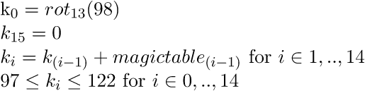

# PoliCTF 2015: reversemeplz

----------
## Challenge details
| Contest        | Challenge     | Category  | Points |
|:---------------|:--------------|:----------|-------:|
| PoliCTF 2015 | reversemeplz | Reversing |    200 |

**Description:**
>*Last month I was trying to simplify an algorithm.. and I found how to mess up a source really really bad. And then this challenge is born. Maybe is really simple or maybe is so hard that all of you will give up. (Good luck!)[challenge/challenge]*

----------
## Write-up

We start out with the usual, binary identification & high-level reversing:

>```bash
>$ file challenge
> challenge; ELF 32-bit LSB executable, Intel 80386, version 1 (SYSV), dynamically linked (uses shared libs), for GNU/Linux 2.6.32, stripped
>```

IDA gives us the following decompilation (with added notations for clarity on our part):

>```c
>int __cdecl check_input(int user_input)
>{
>  signed int contains_invalid_char; // edi@1
>  int index; // esi@1
>  char v3; // al@6
>  int index2; // eax@10
>  char v6; // dl@16
>  char i; // al@16
>  char intermediate; // [sp+3h] [bp-59h]@13
>  char intermediate_1; // [sp+4h] [bp-58h]@6
>  char intermediate_2; // [sp+5h] [bp-57h]@16
>  int intermediate_13; // [sp+10h] [bp-4Ch]@13
>  char intermediate_17; // [sp+14h] [bp-48h]@1
>
>  qmemcpy(&intermediate_17, &magic_table, 0x3Cu);
>  contains_invalid_char = 0;
>  index = 0;
>  do
>  {
>    if ( *(_BYTE *)(user_input + index) <= 96 )
>      *(_BYTE *)(user_input + index) = magic(*(_BYTE *)(user_input + 1) & 1);
>    if ( *(_BYTE *)(user_input + index) > 122 )
>      *(_BYTE *)(user_input + index) = magic(*(_BYTE *)(user_input + 1) & 2);
>    v3 = magic(*(_BYTE *)(user_input + index));
>    *(&intermediate_1 + index) = v3;
>    if ( (unsigned __int8)v3 > 0xCCu && v3 != 0xCFu )
>      contains_invalid_char = 1;
>    ++index;
>  }
>  while ( index != 15 );
>  index2 = 0;
>  if ( contains_invalid_char != 1 )
>  {
>    while ( 1 )
>    {
>      ++index2;
>      if ( (unsigned __int8)*(&intermediate_1 + index2) - (unsigned __int8)*(&intermediate + index2) != *(&intermediate_13 + index2) )
>        break;
>      if ( index2 == 14 )
>      {
>        if ( *(_BYTE *)(user_input + 15) )
>        {
>          v6 = intermediate_2;
>          for ( i = intermediate_1; i != 0xCCu; i ^= v6-- )
>            ;
>          return 0;
>        }
>        if ( magic(0) )
>          return 0;
>        return (unsigned __int8)magic(*(_BYTE *)user_input) == 98;
>      }
>    }
>  }
>  return 0;
>}
>
>int __cdecl magic(char a1)
>{
>  char v1; // al@1
>  signed int v2; // edi@1
>  int v3; // ebx@3
>  signed int v4; // edi@3
>  int v5; // ebx@5
>  signed int v6; // edi@5
>  int v7; // ebx@7
>  signed int v8; // edi@7
>  char v9; // cl@9
>  int v10; // edx@9
>  signed int v11; // edi@9
>  int v12; // edx@9
>  int v13; // edx@11
>  signed int v14; // edi@11
>  signed int v15; // ecx@11
>  int v16; // edx@13
>  signed int v17; // ecx@13
>  int v18; // edx@15
>  signed int v19; // ecx@15
>  int v20; // edx@17
>  signed int v21; // ebx@17
>  int v22; // edx@19
>  signed int v23; // ebx@19
>  int v24; // edx@21
>  signed int v25; // ebx@21
>  int v26; // edx@23
>  signed int v27; // ebx@23
>  int v28; // edx@25
>  signed int v29; // ecx@25
>  int v30; // edx@27
>  signed int v31; // ecx@27
>  int v32; // edx@29
>  signed int v33; // ecx@29
>  signed int v34; // esi@31
>  int v35; // edx@31
>  char v36; // cl@31
>  int v37; // edx@33
>  signed int v38; // esi@33
>  int v39; // edx@35
>  int v40; // edx@37
>  signed int v41; // edi@37
>  int v42; // edx@39
>  signed int v43; // edi@39
>  int v44; // edx@41
>  signed int v45; // ecx@41
>  signed int v46; // esi@43
>  int v47; // edx@43
>  int v48; // esi@45
>  bool v49; // zf@45
>  signed int v50; // eax@45
>  char v52; // [sp+4h] [bp-10h]@9
>
>  v1 = inc_counter(a1);
>  v2 = 19;
>  if ( (v1 & 0x3F) != 38 )
>    v2 = 0;
>  v3 = v2 | ((unsigned __int8)v1 << 8) | 9 * ((v1 & 0x5F) == 86);
>  v4 = 71;
>  if ( (v1 & 0x77) != 116 )
>    v4 = 0;
>  v5 = v4 | v3;
>  v6 = 84;
>  if ( (v1 & 0x3F) != 39 )
>    v6 = 0;
>  v7 = v6 | v5;
>  v8 = 48;
>  if ( (v1 & 0x4F) != 4 )
>    v8 = 0;
>  v9 = v1 & 0x1F;
>  v10 = 3 * ((v1 & 0x57) == 80) | 8 * (v9 == 1) | v7 | v8 | 2 * (v9 == 15) | 2 * ((v1 & 0x5B) == 83);
>  v11 = 114;
>  v52 = ~v1;
>  v12 = 8 * (v9 == 2) | 8 * (v9 == 11) | v10 | 2 * ((v1 & 0x57) == 66) | 8 * ((v1 & 0x2E) == 44);
>  if ( (v1 & 0x37) != 37 )
>    v11 = 0;
>  v13 = v11 | v12;
>  v14 = 16;
>  v15 = 0;
>  if ( (v1 & 0x1C) == 8 )
>    v15 = 16;
>  v16 = ((~v1 & 0x78u) < 1 ? 0x48 : 0) | v15 | v13;
>  v17 = 64;
>  if ( (v1 & 0x1D) != 16 )
>    v17 = 0;
>  v18 = v17 | v16;
>  v19 = 0;
>  if ( (v1 & 0xF) == 11 )
>    v19 = 16;
>  v20 = 4 * ((v1 & 0x55) == 64) | v19 | v18;
>  v21 = 72;
>  if ( (v1 & 0x4B) != 1 )
>    v21 = 0;
>  v22 = v21 | v20;
>  v23 = 24;
>  if ( (v1 & 0x47) != 1 )
>    v23 = 0;
>  v24 = v23 | v22;
>  v25 = 96;
>  if ( (v1 & 0x2B) != 34 )
>    v25 = 0;
>  v26 = ((v52 & 0x55u) < 1 ? 0x48 : 0) | v25 | v24;
>  v27 = 0;
>  if ( (v1 & 0x31) == 16 )
>    v27 = 16;
>  v28 = v27 | v26;
>  v29 = 0;
>  if ( (v1 & 0x55) == 81 )
>    v29 = 68;
>  v30 = v29 | v28;
>  v31 = 0;
>  if ( (v1 & 0xE) == 8 )
>    v31 = 32;
>  v32 = v31 | v30;
>  v33 = 97;
>  if ( (v1 & 0x59) != 72 )
>    v33 = 0;
>  v34 = 81;
>  v35 = v33 | v32;
>  v36 = v1 & 0x17;
>  if ( (v1 & 0x17) != 4 )
>    v34 = 0;
>  v37 = v34 | v35;
>  v38 = 37;
>  if ( (v1 & 0x47) != 66 )
>    v38 = 0;
>  v39 = v37 | v38 | 8 * ((v1 & 0x43) == 2);
>  if ( (v1 & 0x46) != 2 )
>    v14 = 0;
>  v40 = v14 | v39;
>  v41 = 80;
>  if ( v36 != 3 )
>    v41 = 0;
>  v42 = v41 | v40;
>  v43 = 70;
>  if ( v36 != 1 )
>    v43 = 0;
>  v44 = v43 | v42;
>  v45 = 40;
>  if ( (v1 & 0x70) != 64 )
>    v45 = 0;
>  v46 = 0;
>  v47 = 4 * ((v1 & 0x41) == 1) | ((v52 & 0xBu) < 1 ? 0x60 : 0) | v45 | v44;
>  if ( (v1 & 0x48) == 64 )
>    v46 = 32;
>  v48 = v47 | v46;
>  v49 = (v1 & 0x21) == 1;
>  v50 = 0;
>  if ( v49 )
>    v50 = 68;
>  return v48 | v50;
>}
>```

We can see that the first part of the check routine:

>```c
>  do
>  {
>    if ( *(_BYTE *)(user_input + index) <= 96 )
>      *(_BYTE *)(user_input + index) = magic(*(_BYTE *)(user_input + 1) & 1);
>    if ( *(_BYTE *)(user_input + index) > 122 )
>      *(_BYTE *)(user_input + index) = magic(*(_BYTE *)(user_input + 1) & 2);
>    v3 = magic(*(_BYTE *)(user_input + index));
>    *(&intermediate_1 + index) = v3;
>    if ( (unsigned __int8)v3 > 0xCCu && v3 != 0xCFu )
>      contains_invalid_char = 1;
>    ++index;
>  }
>  while ( index != 15 );
>```

Puts some constraints on our character set (lowercase alphanumeric only) and sets up a table containing the 'magic' values of the first 15 input characters. Instead of reversing the magic function we simply ran all valid (ie. loweralpha) inputs through it and saw that the outputs are a simple rot13 of the input. We can also see another part of the table gets initialized from a 'magic table' which holds 15 signed integers:

>```asm
>0xffffdb10:	0xff	0xff	0xff	0xff	0x11	0x00	0x00	0x00
>0xffffdb18:	0xf5	0xff	0xff	0xff	0x03	0x00	0x00	0x00
>0xffffdb20:	0xf8	0xff	0xff	0xff	0x05	0x00	0x00	0x00
>0xffffdb28:	0x0e	0x00	0x00	0x00	0xfd	0xff	0xff	0xff
>0xffffdb30:	0x01	0x00	0x00	0x00	0x06	0x00	0x00	0x00
>0xffffdb38:	0xf5	0xff	0xff	0xff	0x06	0x00	0x00	0x00
>0xffffdb40:	0xf8	0xff	0xff	0xff	0xf6	0xff	0xff	0xff
>0xffffdb48:	0x00	0x00	0x00	0x00
>```

Translating to:

>```python
>magic_table = [-1, 17, -11, 3, -8, 5, 14, -3, 1, 6, -11, 6, -8, -10, 0]
>```

The second part of the check:

>```c
>    while ( 1 )
>    {
>      ++index2;
>      if ( (unsigned __int8)*(&intermediate_1 + index2) - (unsigned __int8)*(&intermediate + index2) != *(&intermediate_13 + index2) )
>        break;
>      if ( index2 == 14 )
>      {
>        if ( *(_BYTE *)(user_input + 15) )
>        {
>          v6 = intermediate_2;
>          for ( i = intermediate_1; i != 0xCCu; i ^= v6-- )
>            ;
>          return 0;
>        }
>        if ( magic(0) )
>          return 0;
>        return (unsigned __int8)magic(*(_BYTE *)user_input) == 98;
>      }
>    }
>```

Establishes a linear relation between the rot13 of input characters 1 to 14 as well as requiring character 15 to be 0x00 and the rot13 of character 0 to be 98.
We can express these constraints as follows:



Which allow us to iteratively determine the key [as follows](solution/reversemeplz_keygen.py):

>```python
>#!/usr/bin/python
>#
># PoliCTF 2015
># reversemeplz (REVERSING/200)
>#
># @a: Smoke Leet Everyday
># @u: https://github.com/smokeleeteveryday
>#
>
>import string
>
>def rot13(char):
>	table = string.maketrans('abcdefghijklmnopqrstuvwxyz', 'nopqrstuvwxyzabcdefghijklm')
>	return string.translate(char, table)
>
>magic_table = [-1, 17, -11, 3, -8, 5, 14, -3, 1, 6, -11, 6, -8, -10, 0]
>
>key = chr(98)
>for i in magic_table:
>	key += chr(ord(key[len(key)-1]) + i)
>
>print "[+]Flag: [flag{%s}]" % rot13(key)
>```

Which gives us:

>```bash
>$ ./reversemeplz.py
>[+]Flag: [flag{onetwotheflagyoo}]
>```