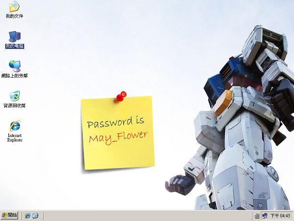

# Trend Micro CTF 2015: Analysis - Defensive 300

----------
## Challenge details
| Contest        | Challenge     | Category  | Points |
|:---------------|:--------------|:----------|-------:|
| Trend Micro CTF 2015 | Analysis - Defensive 300 | Reversing |    300 |

**Description:**
>*Category: Analysis-defensive*
>
>*Points: 300*
>
>*This is a REAL backdoor network traffic!*
>
>*Tracing hacker's footprint to find the key!*
>
>*Hint:*
>
>*Poison Ivy / admin*
>
>*Zip Password: trace_hacker*

----------
## Write-up

We are given an [archive](challenge/net.zip) which contains a PCAP file with traffic from the [Poison Ivy](https://www.fireeye.com/content/dam/fireeye-www/global/en/current-threats/pdfs/rpt-poison-ivy.pdf) backdoor. Poison Ivy encrypts its traffic using the [Camellia](https://en.wikipedia.org/wiki/Camellia_(cipher)) block cipher (in a very [flawed manner](samvartaka.github.io/malware/2015/09/07/poison-ivy-reliable-exploitation/)) and deriving the encryption key directly from an attacker-supplied password (by padding it with null bytes). The default password for Poison Ivy is 'admin' which will allow us to decrypt the traffic in the PCAP.

Luckily MITRE's [ChopShop framework](https://github.com/MITRECND/chopshop) allows us to easily process the PCAP using [FireEye's Poison Ivy 2.3.x module](https://github.com/MITRECND/chopshop/blob/master/modules/poisonivy_23x.py) and extract whatever contents the malware traffic holds.

We use ChopShop in the following manner to decrypt and dump the traffic and extract any transmitted files from it:

```bash
$ ./chopshop -f net.pcap -s ./ "poisonivy_23x -c -w admin"
Warning Legacy Module poisonivy_23x!
Starting ChopShop (Created by MITRE)
Initializing Modules ...
  Initializing module 'poisonivy_23x'
Running Modules ...
[2015-09-04 04:43:44 EDT]  Poison Ivy Version: 2.32
[2015-09-04 04:43:44 EDT]  *** Host Information ***
PI profile ID: ctf
IP address: 192.168.0.100
Hostname: ADMIN-PC
Windows User: Administrator
Windows Version: Windows XP
Windows Build: 2600
Service Pack: Service Pack 3
[2015-09-04 04:43:58 EDT]  *** Directory Listing Initiated ***
Directory: C:\WINDOWS\
[2015-09-04 04:43:58 EDT]  *** Directory Listing Sent ***
[2015-09-04 04:44:57 EDT]  *** Service Listing Sent ***
[2015-09-04 04:45:06 EDT]  *** Screen Capture Sent ***
PI-extracted-file-1-screenshot.bmp saved..
Shutting Down Modules ...
  Shutting Down poisonivy_23x
Module Shutdown Complete ...
ChopShop Complete
```

The extracted screenshot file provides us with the flag:

