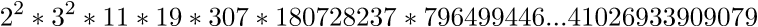

# Trend Micro CTF 2015: crypto100

----------
## Challenge details
| Contest        | Challenge     | Category  | Points |
|:---------------|:--------------|:----------|-------:|
| Trend Micro CTF 2015 | crypto100 | Crypto |    100 |

**Description:**
>*Category: Cryptography*
>
>*Points: 100*
>
>*Decrypt it by your missing private key!*
>
>*kPmDFLk5b/torG53sThWwEeNm0AIpEQek0rVG3vCttc=*
>
>*[You have a strange public key.](challenge/PublicKey.pem)*
>*Where is the lost 1bit?*
>*Let's enjoy your prime factorization:)*

----------
## Write-up

We are given a ciphertext and an RSA public key consisting of:

```
n = 82401872610398250859431855480217685317486932934710222647212042489320711027708 (256-bit public modulus)
e = 65537 (public exponent, fermat number F4)
```

It turned out the public modulus had already been factored:



But as we can see this is not a valid RSA public modulus as a valid modulus has to be the product of exactly two (large) prime numbers. The description suggests a 'lost 1bit' which hints at a bit corruption somewhere in the public modulus so our approach is to iterate over all bits in the modulus, flipping them and for each candidate modulus determine whether it is pre-factored or not (and if so whether the factors indicate a valid RSA modulus) since we assume we won't have to actually factor the correct modulus ourselves.

We wrote [the following script](solution/crypto100_crack.py) to automate this:

```python
#!/usr/bin/env python
#
# Trend Micro CTF 2015
#
# @a: Smoke Leet Everyday
# @u: https://github.com/smokeleeteveryday
#

from Crypto.PublicKey import RSA
from pyprimes import *
from factorlookup import *

# Extended Greatest Common Divisor
def egcd(a, b):
  if (a == 0):
    return (b, 0, 1)
  else:
    g, y, x = egcd(b % a, a)
    return (g, x - (b // a) * y, y)

# Modular multiplicative inverse
def modInv(a, m):
  g, x, y = egcd(a, m)
  if (g != 1):
    raise Exception("[-]No modular multiplicative inverse of %d under modulus %d" % (a, m))
  else:
    return x % m

ciphertext = "kPmDFLk5b/torG53sThWwEeNm0AIpEQek0rVG3vCttc=".decode('base64')
pubKey = RSA.importKey(open("../challenge/PublicKey.pem", 'rb').read())

print "[*]RSA Public key (n = %d, e = %d)" % (pubKey.n, pubKey.e)

# Get binary representation
binrep = "{0:b}".format(pubKey.n)

# Iterate over every bit and flip it
for pos in xrange(len(binrep)):
  c = list(binrep)
  c[pos] = "1" if (c[pos] == "0") else "0"
  candidate_binrep = "".join(c)
  candidate = int(candidate_binrep, 2)

  facstatus = isFactored(candidate)

  if(facstatus[0] > 4):
    if((len(facstatus[1]) == 2) and not(False in [isprime(x) for x in facstatus[1]])):
      print "[+]Found candidate! [%d] [%s]" % (candidate, facstatus[1])
      print "[+]Corresponding private exponent (d = %d)" % d
    else:
      continue

    p = facstatus[1][0]
    q = facstatus[1][1]
    d = modInv(pubKey.e, (p-1)*(q-1))
    privKey = RSA.construct((candidate, pubKey.e, d, p, q, ))

    p = privKey.decrypt(ciphertext)

    # If flag prefix is in plaintext we have our private key
    if("TMCTF" in p):
      print "[+]Plaintext: [%s]" % p
      exit()
```

Which gives the following output when exected:

```bash
$ ./crypto100_crack.py
[*]RSA Public key (n = 82401872610398250859431855480217685317486932934710222647212042489320711027708, e = 65537)
[+]Found candidate! [82401872610398250859431855480217685317486932934710222647212042489320711027709] [[279125332373073513017147096164124452877L, 295214597363242917440342570226980714417L]]
[+]Corresponding private exponent (d = 46174319388196978265129247000251984002598502609436833115707069256591953333505)
[+]Plaintext: [...TMCTF{$@!zbo4+qt9=5}]
```