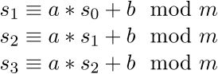
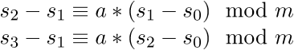
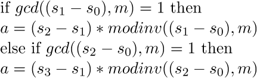
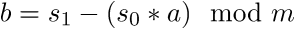
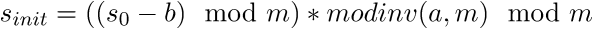
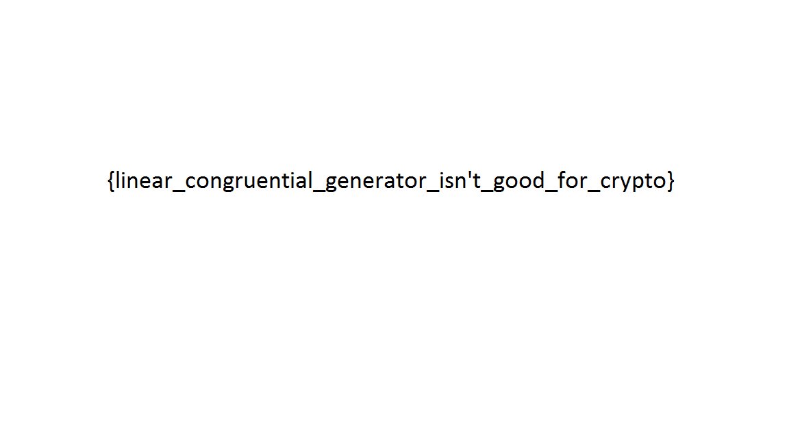

# VolgaCTF Quals 2015: lcg

----------
## Challenge details
| Contest        | Challenge     | Category  | Points |
|:---------------|:--------------|:----------|-------:|
| VolgaCTF Quals 2015 | lcg | Crypto |    100 |

**Description:**
>*lcg*

>*Check out our brand-new cipher. It's super-fast and moderately secure.*

>*[script](challenge/lcg.py)*
>*[ciphertext](challenge/flag.png.bin)*

----------
## Write-up
### First look

We start by taking a look at the provided code:

>```python
>M = 65521
>class LCG():
>	def __init__(self, s):
>		self.m = M
>		(self.a, self.b, self.state) = struct.unpack('<3H', s[:6])
>
>	def round(self):
>		self.state = (self.a*self.state + self.b) % self.m
>		return self.state
>
>	def generate_gamma(self, length):
>		n = (length + 1) / 2
>		gamma = ''
>		for i in xrange(n):
>			gamma += struct.pack('<H', self.round())
>		return gamma[:length]
>
>def encrypt(data, key):
>	assert(len(key) >= 6)
>	lcg = LCG(key[:6])
>	gamma = lcg.generate_gamma(len(data))
>	return ''.join([chr(d ^ g)  for d,g in zip(map(ord, data), map(ord, gamma))])
>
>def decrypt(ciphertext, key):
>	return encrypt(ciphertext, key)
>
>def sanity_check():
>	data = 'A'*100
>	key = os.urandom(6)
>	ciphertext = encrypt(data, key)
>	decrypted_data = decrypt(ciphertext, key)
>	assert(data == decrypted_data)
>```

As we can see encrypt is a stream cipher that xors the plaintext with the continuous output of the LCG PRNG which is seeded with a randomly generated 768-bit key. Both the challenge name and the fact that each PRNG state is defined as state[i+1] = (a*state[i] + b) mod m indicate that the PRNG is a [linear congruential generator](http://en.wikipedia.org/wiki/Linear_congruential_generator).

### Attack

The problem here is that LCGs aren't cryptographically secure PRNGs as the internal states and the initial state can be easily recovered from a series of 3 successive outputs.
Since the ciphertext is stored in a file named flag.png.bin we assume the original file was a PNG image which has a fixed header:

>```python
>"\x89\x50\x4E\x47\x0D\x0A\x1A\x0A"
>```

thus giving us 8 bytes of known plaintext to recover 8 bytes of LCG keystream output. Since every 2 bytes of keystream correspond to an LCG state:

>```python
>struct.pack('<H', self.round())
>```

We can thus recover 3 successive outputs (which correspond directly to their internal states) which is enough to reconstruct the full LCG PRNG. To see [why this is the case](http://alumni.cs.ucr.edu/~jsun/random-number.pdf) consider, given known modulus m, the system of linear congruence equations corresponding to 3 successive outputs:



By subtracting equation 1 from equations 2 and 3 we get the following:



Which is a system of 2 linear congruence equations in 2 unknowns which can be solved easily for a by multiplying one hand of the equation with the modular multiplicative inverse of a's coefficient (if it exists, ie. if gcd(c,m)=1) as follows:



Once we have a we can trivially obtain b:



and the initial state:



With a, b and the initial state recovered [we can reconstruct the full LCG PRNG](solution/lcg_crack.py) and hence obtain the keystream to decrypt the ciphertext:

>```python
>#!/usr/bin/python
>#
># VolgaCTF Quals 2015
># lcg (CRYPTO/100)
>#
># @a: Smoke Leet Everyday
># @u: https://github.com/smokeleeteveryday
>#
>
>import struct
>
># Extended Greatest Common Divisor
>def egcd(a, b):
>    if a == 0:
>        return (b, 0, 1)
>    else:
>        g, y, x = egcd(b % a, a)
>        return (g, x - (b // a) * y, y)
>
>M = 65521
>class LCG():
>	def __init__(self, s, a=None, b=None, state=None):
>		self.m = M
>		if((a != None) and (b != None) and (state != None)):
>			(self.a, self.b, self.state) = (a, b, state)
>		else:
>			(self.a, self.b, self.state) = struct.unpack('<3H', s[:6])
>
>	def getvars(self):
>		return self.a, self.b
>
>	def round(self):
>		self.state = (self.a*self.state + self.b) % self.m
>		return self.state
>
>	def generate_gamma(self, length):
>		n = (length + 1) / 2
>		gamma = ''
>		for i in xrange(n):
>			gamma += struct.pack('<H', self.round())
>		return gamma[:length]
>
># PNG header
>knownplaintext = "\x89\x50\x4E\x47\x0D\x0A\x1A\x0A"
>
>with open('flag.png.bin', 'rb') as f:
>	ciphertext = f.read()
>
># Recovered keystream
>recgamma = ''.join([chr(d ^ c) for d,c in zip(map(ord, knownplaintext), map(ord, ciphertext))])
>
>print "[+]Recovered keystream: [%s]" % recgamma.encode('hex')
>
># Recovered states
>states = {}
># Only need at most 3 equations
>for i in xrange(0, min(4, len(recgamma)/2)):
>	# Take endian-ness into account
>	state = recgamma[(2*i): (2*i)+2]
>	states[i] = struct.unpack('<H', state)[0]
>
># subtract eq. 0 from 1 and 2
>x = states[2]-states[1]
>alpha = states[1]-states[0]
>
>y = states[3]-states[1]
>beta = states[2]-states[0]
>
># recover a, b
>g, p, q = egcd(alpha, M)
>g2, p2, q2 = egcd(beta, M)
>
>if(g == 1):
>	mod_inv = p % M
>	a = (x * mod_inv) % M
>elif(g2 == 1):
>	mod_inv = p2 % M
>	a = x * mod_inv % M
>else:
>	print "[-]No modular multiplicative inverse found :("
>	exit()
>
>b = states[i]-(states[i-1]*a) % M
># inverse of a
>g, p, q = egcd(a, M)
>a_inv = p
>init_state = (((states[0]-b)%M)*a_inv)%M
>
># Recover LCG
>print "[+]Recovered LCG(a=%d, b=%d, init=%d)" % (a, b, init_state)
>
>lcg = LCG("", a=a, b=b, state=init_state)
>gamma = lcg.generate_gamma(len(ciphertext))
>decrypted = ''.join([chr(d ^ g)  for d,g in zip(map(ord, ciphertext), map(ord, gamma))])
>
>f = open('flag.png','wb')
>f.write(decrypted)
>f.close()
>
>print "[+]Done!"
>```

Which produces the output:

>```bash
>$ ./lcg_crack.py
>[+]Recovered keystream: [109ecdae50eac2ea]
>[+]Recovered LCG(a=44882, b=50579, init=37388)
>[+]Done!
>```

Giving flag file:


