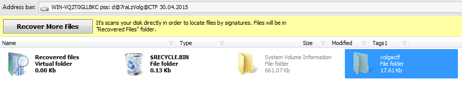
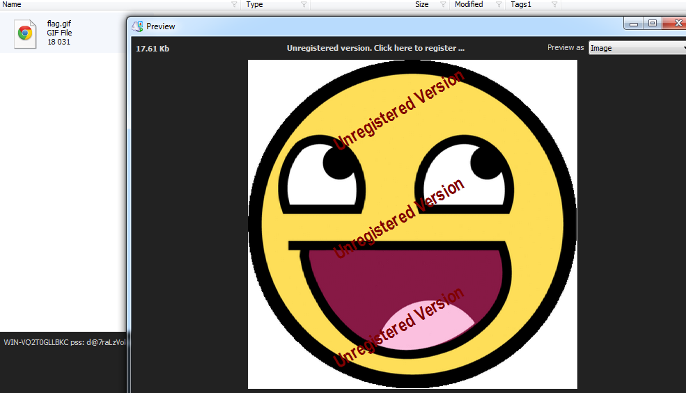
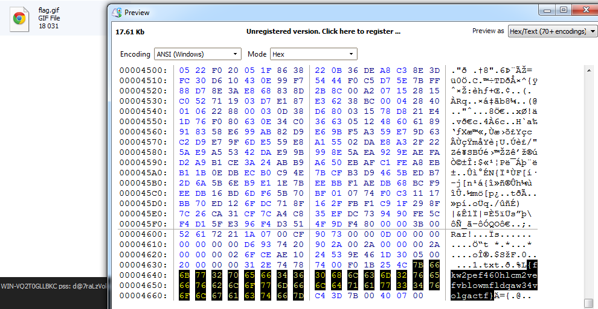

# VolgaCTF Quals 2015: Russian doll

----------
## Challenge details
| Contest        | Challenge     | Category  | Points |
|:---------------|:--------------|:----------|-------:|
| VolgaCTF Quals 2015 | Russian doll | Forensics |    300 |

**Description:**
>*Russian doll*

>*We got a strange file, can you find a flag in it image*

----------
## Write-up

We are given a 500MB file called "russian_doll.iso" about which file has to say the following:

>```bash
> file russian_doll.iso
>
> russian_doll.iso; x86 boot sector, code offset 0x58, OEM-ID "-FVE-FS-", sectors/cluster 8, reserved sectors 0, Media descriptor 0xf8, heads 255, hidden sectors 46626816, FAT (32 bit), sectors/FAT 8160, reserved3 0x800000, serial number 0x0, unlabeled
>```

The "-FVE-FS-" OEM-ID indicates we are probably dealing with a [bitlocker encrypted volume](http://www.forensicswiki.org/wiki/BitLocker_Disk_Encryption). So we fire up [Diskinternals EFS recovery](http://www.diskinternals.com/efs-recovery/) and mount russian_doll.iso as a raw disk image. In the Diskinternals EFS recovery interface we can now see the volume name which contains the pass (WIN-VQ2T0GLLBKC pss : d@7raLzVolg@CTF):


Next we perform recovery on disk (choosing Fast EFS recovery), enter the password (d@7raLzVolg@CTF) and after being notified no deleted files have been recovered we are presented with an overview of the folders and files in the volume:



The volume contains only a single file called "flag.gif" which we can preview (but not save in our trial version):



Taking a look at the file with the built-in hex viewer we can see the flag all the way down at the end of the file:



Giving us the flag:

>*{fkw2pef460hlcm2vefvblowmfldqaw34volgactf}*