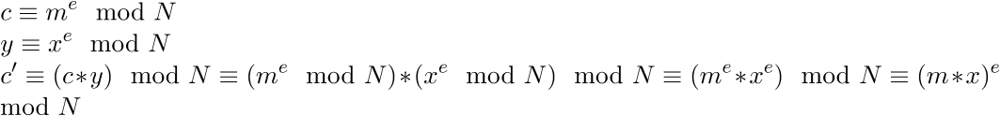

# Plaid CTF 2016: rabit

## Challenge details
| Event | Challenge | Category | Points |
|:------|:----------|:---------|-------:|
| Plaid CTF | rabit | Crypto | 175 |

### Description
> Just [give me a bit](challenge), the least significant's enough. Just a second we’re not broken, just very, very insecure. Running at rabit.pwning.xxx:7763

## Write-up

This challenge consisted of the following python server:

```python
#/usr/bin/env python

from Crypto.Random import random, atfork
from Crypto.Util.number import bytes_to_long, long_to_bytes
from hashlib import sha1

import SocketServer,threading,os,time
import signal

from util import *
from key import *

PORT = 7763
FLAG = "REDACTED"
msg = """Welcome to the LSB oracle! N = {}\n""".format(N)

def pad(s):
    assert(len(s) < N.bit_length() / 8)
    padded = bytes_to_long(s.ljust(N.bit_length()/8, padchar))
    while decrypt(padded, p, q) == None:
        padded += 1
    return padded

padded = pad(FLAG)
enc_flag = encrypt(padded, N)

assert long_to_bytes(padded)[:len(FLAG)] == FLAG
assert decrypt(enc_flag, p, q) == padded
assert decrypt(2, p, q) != None

def proof_of_work(req):
    import string
    req.sendall("Before we begin, a quick proof of work:\n")
    prefix = "".join([random.choice(string.digits + string.letters) for i in range(10)])
    req.sendall("Give me a string starting with {}, of length {}, such that its sha1 sum ends in ffffff\n".format(prefix, len(prefix)+5))
    response = req.recv(len(prefix) + 5)
    if sha1(response).digest()[-3:] != "\xff"*3 or not response.startswith(prefix):
        req.sendall("Doesn't work, sorry.\n")
        exit()

class incoming(SocketServer.BaseRequestHandler):
    def handle(self):
        atfork()
        req = self.request
        signal.alarm(60)

        def recvline():
            buf = ""
            while not buf.endswith("\n"):
                buf += req.recv(1)
            return buf

        proof_of_work(req)

        signal.alarm(120)

        req.sendall(msg)

        req.sendall("Encrypted Flag: {}\n".format(enc_flag))
        while True:
            req.sendall("Give a ciphertext: ")
            x = long(recvline())
            m = decrypt(x, p, q)
            if m == None:
                m = 0
            req.sendall("lsb is {}\n".format(m % 2))

        req.close()

class ReusableTCPServer(SocketServer.ForkingMixIn, SocketServer.TCPServer):
  pass

SocketServer.TCPServer.allow_reuse_address = True
server = ReusableTCPServer(("0.0.0.0", PORT), incoming)

print "Listening on port %d" % PORT
server.serve_forever()
```

When we connect to it it presents us with a simple proof-of-work after which we are given the flag in encrypted form and we can decrypt an arbitrary number of ciphertexts but we are only given the least significant bit of each corresponding plaintext. When we look at the encryption algorithm that's used we can identify it as the [Rabin cryptosystem](https://en.wikipedia.org/wiki/Rabin_cryptosystem).

The problem with leaking the least significant bit of the flag plaintext here is that this presents us with a so-called [parity oracle](http://cryptopals.com/sets/6/challenges/46/) (ie. we can determine the plaintext parity from the LSB). This infoleak can be used in a variety of ways but in this case we can use it completely recover the plaintext.

In [malleable](https://en.wikipedia.org/wiki/Malleability_(cryptography)) cryptosystems like 'schoolbook' RSA and Rabin the property exists that:



As such we can arbitrarily multiply the plaintext. Hence if we choose to multiply the ciphertext with `2^2` we double the underlying plaintext of which we will get the LSB. We know that if the remainder after modular reduction is odd this indicates `2*P > N` since N is odd and hence we know a 'modular wraparound' occurred. If the remainder is even we know `2*P < N` since N is odd and hence we know it didn't 'wrap around the modulus'. We can apply this process in incremental fashion to build a [binary-search style](https://en.wikipedia.org/wiki/Binary_search_algorithm) algorithm which adjusts its lower and upper bound according to the results of these iterative multiplications allowing us to recover the plaintext in approximately `O(log2(N))` time with the nice side-effect of giving 'hollywood-style' progressive decryption. The code looks as follows:

```python
#!/usr/bin/env python
#
# Plaid CTF 2016
# tonnerre (CRYPTO/200)
#
# @a: Smoke Leet Everyday
# @u: https://github.com/smokeleeteveryday
#

import re
import math
import string
import hashlib
import itertools
from pwn import *
from Crypto.Util.number import bytes_to_long, long_to_bytes

def encrypt(m, N):
    return pow(m, 2, N)

def proof_of_work(prefix, plen, endv):
  # Should be sufficient charset
  charset = string.letters + string.digits

  # Bruteforce bounds
  lower_bound = plen - len(prefix)
  upper_bound = plen - len(prefix)

  # Find proof-of-work candidate
  for p in itertools.chain.from_iterable((''.join(l) for l in itertools.product(charset, repeat=i)) for i in range(lower_bound, upper_bound + 1)):
    candidate = prefix + p
    assert (len(candidate) == plen)

    if ((candidate[:len(prefix)] == prefix) and (hashlib.sha1(candidate).hexdigest()[-6:] == endv)):
      return candidate

  raise Exception("[-] Could not complete proof-of-work...")
  return

def give_proof_of_work(h, line):
  prefix, plen, endv = re.findall('starting\swith\s(.+?),\sof\slength\s([0-9]+?),\ssuch\sthat\sits\ssha1\ssum\sends\sin\s(.+?)$', line, re.M|re.I)[0]
  print "[*] Got proof-of-work request [%s] (%s, %s), finding proof-of-work..." % (prefix, plen, endv)
  proof = proof_of_work(prefix, int(plen), endv)
  print "[+] Found proof-of-work: [%s]" % proof
  h.sendline(proof)
  return

def extract_n(line):
  return re.findall('N = (.*?)$', line, re.M|re.I)[0]

def extract_eflag(line):
  return re.findall(':\s(.*?)$', line, re.M|re.I)[0]

def extract_lsb(line):
  return re.findall('lsb\sis\s(.*?)$', line, re.M|re.I)[0]

def decryption_oracle(ciphertext):
  h.recvuntil('Give a ciphertext: ')
  h.sendline(ciphertext)
  lsb_line = h.recvline()
  if not(lsb_line.startswith('lsb is')):
    raise Exception("[-] Invalid lsb line [%s]" % lsb_line)
  return extract_lsb(lsb_line)

def lsb_oracle_attack(encrypted_flag, N):
  m_lowerbound = 0
  m_upperbound = N
  iter_count = math.log(N, 2) # iterate log2(N) times
  C = encrypted_flag

  for i in xrange(0, long(math.ceil(long(iter_count)))):
    # c = (2^2 mod N * m^2 mod N) = ((2^2 * m^2) mod N) = (2m)^2 mod N
    C = ((encrypt(2, N) * C) % N)
    p_lsb = decryption_oracle(str(C))

    if (int(p_lsb) == 1):
      # mul_fac*m is odd so mul_fac*m > N (remainder after modular reduction is odd since N is odd)
      # Hence m > N/mul_fac so we increase the lowerbound
      m_lowerbound = ((m_upperbound + m_lowerbound) / 2)
    elif (int(p_lsb) == 0):
      # mul_fac*m is even so mul_fac*m <= N
      # Hence m <= N/mul_fac so we decrease the upperbound
      m_upperbound = ((m_upperbound + m_lowerbound) / 2)

    print "[*] %s" % long_to_bytes(m_upperbound)

  return

host = 'rabit.pwning.xxx'
port = 7763

welcome_msg = 'Welcome to the LSB oracle!'
eflag_msg = 'Encrypted Flag'

h = remote(host, port, timeout = None)

l1 = h.recvline()
l2 = h.recvline()

give_proof_of_work(h, l2)

welcome = h.recvline()

if not(welcome.startswith(welcome_msg)):
  raise Exception("[-] Invalid welcome message [%s]..." % welcome)

N = long(extract_n(welcome))

encrypted_flag_msg = h.recvline()

if not(encrypted_flag_msg.startswith(eflag_msg)):
  raise Exception("[-] Invalid eflag msg [%s]" % encrypted_flag_msg)

encrypted_flag = long(extract_eflag(encrypted_flag_msg))

print "[*] N: [%s]" % N
print "[*] C: [%s]" % encrypted_flag

print "[*] Starting LSB oracle attack ..."

flag = lsb_oracle_attack(encrypted_flag, N)

h.close()
```

Which after running gives us the flag:

```
PCTF{LSB_is_4ll_y0u_ne3d}
```