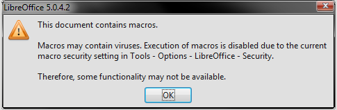

# SharifCTF 2016: Kick Tort Teen

## Challenge details
| Event | Challenge | Category | Points |
|:------|:----------|:---------|-------:|
| SharifCTF | Kick Tort Teen | Forensics | 50 |

### Description
> Anagram, anyone?
>
> [Download](challenge/data.xls)

## Write-up
The challenge gives us an *Excel* spreadsheet ([data.xls](challenge/data.xls)). As soon as we open this file in LibreOffice, we are prompted with a warning about embedded macros.



After acknowledging the warning we can see there's a grid of 23*14747 cells that hold numbers. So let's take a look at the macros we were warned about earlier. Via `Tools > Macros > Organize macros > LibreOffice Basic` we can see that file contains three macros under `Modules > Module1`. We can view the actual code by selecting `Edit`:

```vbscript
Rem Attribute VBA_ModuleType=VBAModule
Option VBASupport 1
Function FileExists(ByVal FileToTest As String) As Boolean
   FileExists = (Dir(FileToTest) <> "")
End Function
Sub DeleteFile(ByVal FileToDelete As String)
   If FileExists(FileToDelete) Then 'See above
      SetAttr FileToDelete, vbNormal
      Kill FileToDelete
   End If
End Sub
Sub DoIt()
    Dim filename As String
    filename = Environ("USERPROFILE") & "\fileXYZ.data"
    DeleteFile (filename)

    Open filename For Binary Lock Read Write As #2
    For i = 1 To 14747
        For j = 1 To 23
            Put #2, , CByte((Cells(i, j).Value - 78) / 3)
        Next
    Next

    Put #2, , CByte(98)
    Put #2, , CByte(13)
    Put #2, , CByte(0)
    Put #2, , CByte(73)
    Put #2, , CByte(19)
    Put #2, , CByte(0)
    Put #2, , CByte(94)
    Put #2, , CByte(188)
    Put #2, , CByte(0)
    Put #2, , CByte(0)
    Put #2, , CByte(0)

    Close #2
End Sub
```

This shows there's the `FileExists` function and two subroutines `DeleteFile` and `DoIt`. `FileExists` only checks if a given a file is present on the system, while `DeleteFile` deletes a file. The interesting code clearly is in `DoIt`. Basically what this macro will do is iterate over all the cells, do a minimal calculation over the value, convert it to a `CByte` and write the result to a file `fileXYZ.data` in the directory specified by the `USERPROFILE` environment variable. Finally it appends a couple more bytes to the file.

Instead of running the macro from inside the spreadsheet, we exported the data in a more friendly [csv](solution/data.csv) format and wrote a simple Python script that will do the same as the `DoIt` macro.

```python

def main():

    data = []

    print('[+] Reading values', end='... ')
    with open('data.csv') as f:
        for line in f:
            for i in line.split(','):
                value = (int(i) - 78) // 3
                data.append(value)
    print('done')

    with open('fileXYZ.data', 'wb') as f:
        print('[+] Writing decoded bytes', end='... ')
        f.write(bytes(data))
        print('done')

        print('[+] Writing trailing bytes', end='...')
        f.write(bytes([98, 13, 0, 73, 19, 0, 94, 188, 0, 0, 0]))
        print('done')

    print('[+] Done: fileXYZ.data')


if __name__ == '__main__':
    main()

```

Let's see what we produced:

```bash

> $ file fileXYZ.data
> fileXYZ.data: ELF 64-bit LSB executable, x86-64, version 1 (GNU/Linux), statically linked, stripped

```

### Solution
Running the file now presents us with the flag:

```bash

> $ ./fileXYZ.data
> SharifCTF{5bd74def27ce149fe1b63f2aa92331ab}

```
