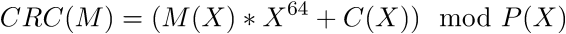
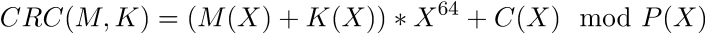
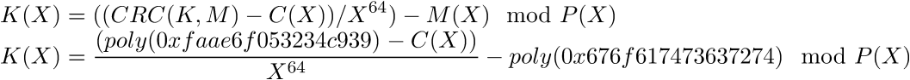

# TU CTF 2016: hash n bake

## Challenge details
| Event | Challenge | Category | Points |
|:------|:----------|:---------|-------:|
| TU CTF | hash n bake | Crypto | 200 |

### Description
> A random goat from Boston hashed our password! Can you find the full output?
>
>Note, flag is what would have printed. I.e. TUCTF{0xadeadbeef1dea}

## Write-up

We are given [the following python script](challenge/hbake.py):

```python
#!/usr/bin/env python

def to_bits(length, N):
    return [int(i) for i in bin(N)[2:].zfill(length)]

def from_bits(N):
    return int("".join(str(i) for i in N), 2)

CONST2 = to_bits(65, (2**64) + 0x1fe67c76d13735f9)
CONST = to_bits(64, 0xabaddeadbeef1dea)

def hash_n_bake(mesg):
    mesg += CONST
    shift = 0
    while shift < len(mesg) - 64:
        if mesg[shift]:
            for i in range(65):
                mesg[shift + i] ^= CONST2[i]
        shift += 1
    return mesg[-64:]

def xor(x, y):
    return [g ^ h for (g, h) in zip(x, y)]

PLAIN_1 = "goatscrt"
PLAIN_2 = "tu_ctf??"

def str_to_bits(s):
    return [b for i in s for b in to_bits(8, ord(i))]

def bits_to_hex(b):
    return hex(from_bits(b)).rstrip("L")

if __name__ == "__main__":
    with open("key.txt") as f:
        KEY = to_bits(64, int(f.read().strip("\n"), 16))
    print PLAIN_1, "=>", bits_to_hex(hash_n_bake(xor(KEY, str_to_bits(PLAIN_1))))
    print "TUCTF{" + bits_to_hex(hash_n_bake(xor(KEY, str_to_bits(PLAIN_2)))) + "}"

#  Output
#  goatscrt => 0xfaae6f053234c939
#  TUCTF{****REDACTED****}
```

The script applies some sort of hashing function to a XOR of a secret key and an input message making it a keyed hash function `H(m, k) = h(m ^ k)`. We are given a single message/hash digest pair for the unknown secret key and are expected to reproduce the second digest.

Upon closer inspection we can see the hash function `hash_n_bake` is a 64-bit [Cyclic Redundancy Check (CRC)](https://en.wikipedia.org/wiki/Cyclic_redundancy_check) function. CRC consists of the multiplication of polynomials modulo a given CRC polynomial `P(x)`. In this case the CRC polynomial is `P(x) = CONST2`. We can write the `hash_n_bake` CRC as the following polynomial:



Where `C(X) = 0xabaddeadbeef1dea` and `P(X) = (2**64) + 0x1fe67c76d13735f9`.

We kan thus write the keyed CRC `H(m, k)` as a polynomial as well:



CRCs have the property of being affine over `GF(2)`. It holds that `CRC(x xor y) = CRC(x) xor CRC(y)` which means that we have `H(m, k) = h(m ^ k) = h(m) ^ h(k)`. Since we have a message/hash digest pair (`PLAIN_1 = goatscrt = 0x676f617473637274` => `0xfaae6f053234c939`) for the target secret key we know `H(0x676f617473637274, k) = 0xfaae6f053234c939` and we can rewrite the keyed CRC polynomial equation as an expression of `K` where we know all the terms on the right-hand side:



Note that here `poly` denotes the representation of the integer as a polynomial.

Since `X**64` has a modular multiplicative inverse under `P(X)` we can divide (ie. multiply with the modular multiplicative inverse) by it and evaluate the expression to obtain our key. The following [SageMath](https://en.wikipedia.org/wiki/SageMath) script takes care of that:

```python
def integer_to_poly(npoly):
    return sum(c*X**e for e, c in enumerate(Integer(npoly).bits()))

def poly_to_integer(poly):
    return sum(int(poly[i])*(1 << i) for i in xrange(poly.degree() + 1))

# Define our CRC
X = GF(2).polynomial_ring().gen()
P = integer_to_poly((2**64) + 0x1fe67c76d13735f9)
C = integer_to_poly(0xabaddeadbeef1dea)

# Our message/digest pair
M = integer_to_poly(0x676f617473637274) # PLAIN_1
H = integer_to_poly(0xfaae6f053234c939) # CRC(K, PLAIN_1)

# K = (N / D) - M mod P
N = (H - C) % P
D = X**64

assert (1 == gcd(P, D))

K = ((N * inverse_mod(D, P)) - M) % P
print hex(poly_to_integer(K))
```

This gives us secret key `0x1b99b8f19a2106b1` which we can then feed into the script to retrieve the keyed CRC for the second plaintext:

```python
PLAIN_2 = "tu_ctf??"
KEY = to_bits(64, int('1b99b8f19a2106b1', 16))
print "TUCTF{" + bits_to_hex(hash_n_bake(xor(KEY, str_to_bits(PLAIN_2)))) + "}"
```

Giving us the flag: `TUCTF{0xf38d506b748fc67}`