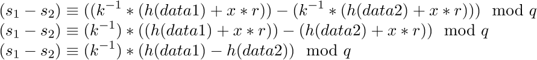
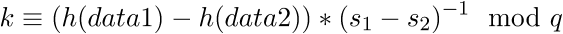
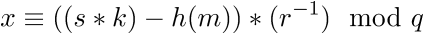

# VolgaCTF 2016: lazy

## Challenge details
| Event | Challenge | Category | Points |
|:------|:----------|:---------|-------:|
| VolgaCTF | lazy | Crypto | 250 |

### Description
> There's some valuable data on the server. However, to retrieve it we can only execute "signed" commands. We have the server script and some other files. Dare to take a look at it?
> 
> nc lazy.2016.volgactf.ru 8889
> 
> [server key exit leave](challenge)

## Write-up

We're given a service that only accepts signed commands, let's take a look at the server code:

```python
            if not self.do_challenge():
                raise Exception('Failed to pass the test')
            (p, q, g, x, y) = import_private_key(keys_file_path)
            while True:
                message = read_message(self.request)
                (r_str, s_str, cmd_exp) = message.split('\n')
                logger.debug('Accepting command {0}'.format(cmd_exp))
                (r, s) = (mpz(r_str), mpz(s_str))
                if not verify(cmd_exp, p, q, g, y, r, s):
                    raise Exception('Signature verification check failed')
                cmd = shlex.split(cmd_exp)[0]
                if cmd == 'ls':
                    ret_str = run_cmd(cmd_exp)
                    send_message(self.request, ret_str)
                elif cmd == 'dir':
                    ret_str = run_cmd(cmd_exp)
                    send_message(self.request, ret_str)
```

Here `do_challenge` is a simple proof-of-work function to deter brute-forcing and the like. Generation and verification of signatures is done with the following code:

```python
def sign(data, p, q, g, x, k):
    r = pow(g, k, p) % q
    s = (invert(k, q) * (SHA1(data) + x * r)) % q
    return (r, s)

def verify(data, p, q, g, y, r, s):
    if not (r > 0 and r < q): return False
    if not (s > 0 and s < q): return False
    w = invert(s, q)
    u1 = (SHA1(data) * w) % q
    u2 = (r * w) % q
    v = ((pow(g, u1, p) * pow(y, u2, p)) % p) % q
    if v == r:
        return True
    else:
        return False
```

We recognize this as the [Digital Signature Algorithm (DSA)](https://en.wikipedia.org/wiki/Digital_Signature_Algorithm). Signing is done with a private key, verification with a public key. So what do we have? We have the [public key](challenge/key.public) and two signatures: [leave.sig](challenge/leave.sig) and [exit.sig](challenge/exit.sig). Signatures come in the form `(r, s)` where `r = (g**k mod p) mod q` and `s = ((k**(-1) mod q) * (H(data) + x * r)) mod q`. Let's take a look at the signatures we have:

```
[*] Signature(exit) (r = 618115531371374705088478644225735834217345085623, s = 172143370381913466209965676314309162396852880243)
[*] Signature(leave) (r = 618115531371374705088478644225735834217345085623, s = 132450039864758067994560555212301135386357959258)
```

We can see here that for both signatures `r` is identical which implies for both signatures the value `k` is identical. DSA requires `k` to be [unique, unpredictable and secret](http://rdist.root.org/2010/11/19/dsa-requirements-for-random-k-value/) and if this is not the case the private key is exposed.

Consider the following for two pieces of data `data1, data2` and their signatures `(r1, s1), (r2, s2)` where `r1=r2`:



and hence we can recover k as follows:



Once we have `k` we can recover the secret key `x` as follows from a given message `m` and its signature `(r,s)`:



Once we have the secret key we can craft signatures for every command we wish and effectively have a (limited) signed shell. The [following script](solution/lazy_crack.py) automates this:

```bash
$ ./lazy_crack.py
[*] Public key (p = 68512153291206841611754462560551037146984131865308362132039007763901629656419762685119654739431977137189082405306180782455460879808641023924533650186918387984473208103949939025064669161570420035977887544113169392280026656271303132002190980625983572858137777505730536249707595163952630465918222171776836844973, q = 778989982803454158276426691152625663891191165251, g = 64998036981102362704978476508972628582882576868369737500314734280328492119395180544097132899416011014425358276490367894352196112650427253804154125193997276351284916878713359366436205241155848152230136737798001316810221728002947999297364648683856119056494147087593939606104012882954758126871201581561126419354, y = 57256445660178680165036356665612916152021216483964990386924735528197218686220324233652057277625641326373730546367828989082916074941941027821863926510923998385446215270789891185067541626307704929851912451924146452244610185080849993156400989168309076549651410516049200914509815378543421307788428686312783632879)
[*] Signature(exit) (r = 618115531371374705088478644225735834217345085623, s = 172143370381913466209965676314309162396852880243)
[*] Signature(leave) (r = 618115531371374705088478644225735834217345085623, s = 132450039864758067994560555212301135386357959258)
[+] Recovered k = 100100100154852483453737534537345357
[+] Recovered x = 189484271473894423631545816033980054817048434088
[+] Opening connection to lazy.2016.volgactf.ru on port 8889: Done
[*] Got [fd4KqW2KDX6ke2OF] (21, 16), finding proof-of-work...
[+] Found proof-of-work: [fd4KqW2KDX6ke2OFaSQur]
$ ls
exit.sig
flag.txt
key.private
key.public
leave.sig
server.py

$ cat flag.txt
VolgaCTF{Do_not_be_lazy_use_nonce_only_once}
```