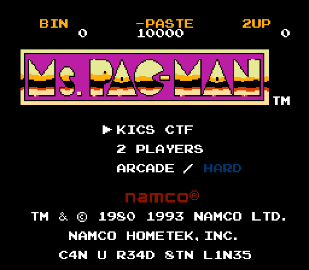
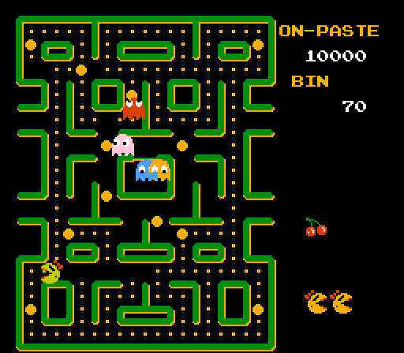
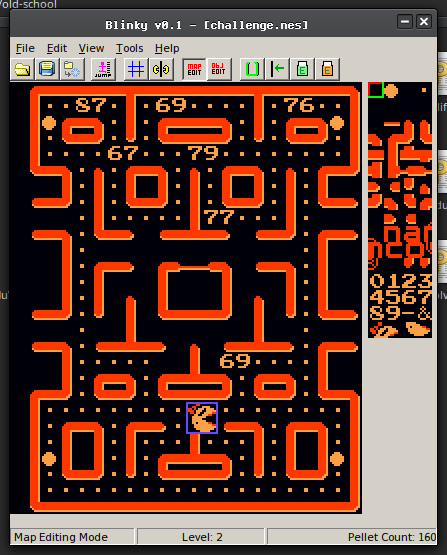
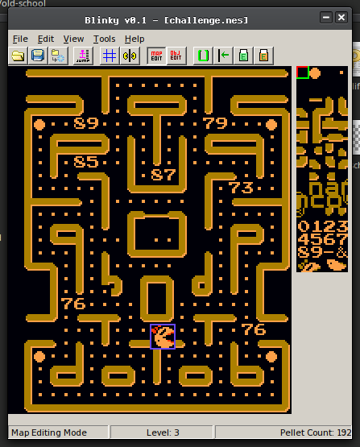
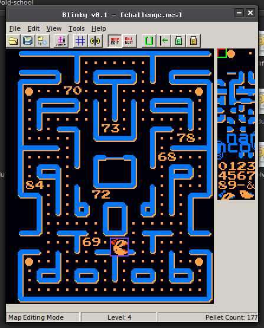
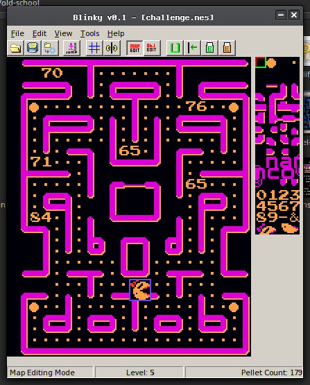
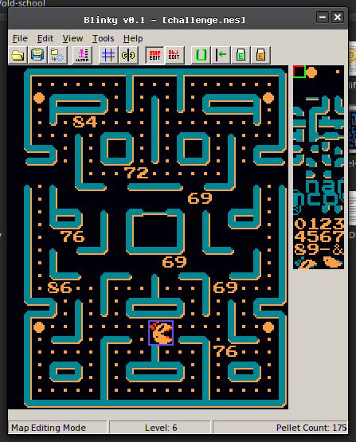
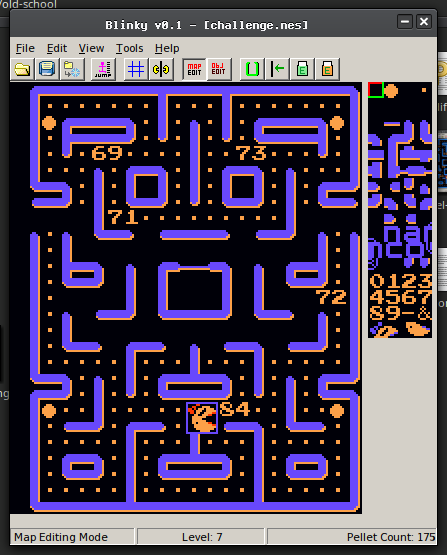
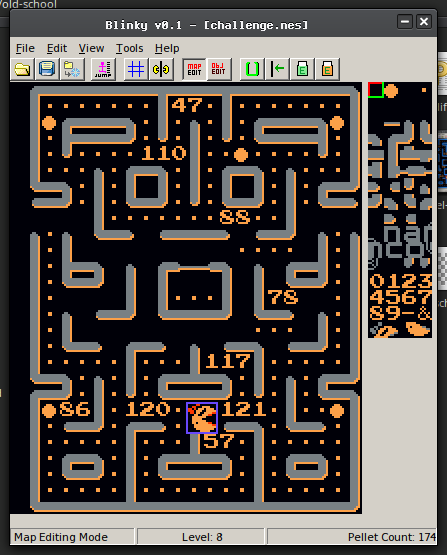

# KASPERSKY INDUSTRIAL CTF QUALS 2017: Old School

## Challenge details
| Event | Challenge | Category | Points |
|:------|:----------|:---------|-------:|
| Kaspersky Industrial CTF Quals 2017 | Old School | Fun | 150 |

### Description
> Hey! Do you like playing? Are you old school?
>
> Have fun!
>
> Concat answer to KLCTF prefix
>
> [OLD_SCHOOL.bin](challenge/old_school.bin)

## Write-up
We are given [old_school.bin](challenge/old_school.bin), so let's first figure out what
kind of file this is:

```bash
$ file old_school.bin
old_school.bin: NES ROM image (iNES): 2x16k PRG, 1x8k CHR [V-mirror]
```

So it's a NES rom. Let's fire up a NES emulator (we used Nestopia) and check it
out.



So it seems we are dealing with an edited version of Ms. Pac-Man. Starting the
game loads the first level identically to the original.



### Solution
After finishing the first level successfully, the second level is loaded. We
notice, but now with some numbers floating around. In stead of playing through
the whole game, we can use a level editor
([Blinky](https://www.romhacking.net/utilities/393/)) for the original game to
quickly see what all the levels look like. Levels 2 to 8 contain numbers:









This gives us the following sequence of numbers:

```
level 2:  87  69  76  67  79  77  69
level 3:  89  79  85  87  73  76  76
level 4:  70  73  78  68  84  72  69
level 5:  70  76  65  71  65  84
level 6:  84  72  69  76  69  86  69  76
level 7:  69  73  71  72  84
level 8:  47 110  88  78 117  86 120 121 57
```

If we convert the numbers (as decimals) to their corresponding ascii codes we
get:  `WELCOMEYOUWILLFINDTHEFLAGATTHELEVELEIGHT/nXNuVxy9`

The score view on the right of the level has been changed. Where the original
says `HI-SCORE` and `1UP`, our version says `ON-PASTE` and `BIN`. So obviously
we need to check [https://pastebin.com/nXNuVxy9](https://pastebin.com/nXNuVxy9),
where we find a base64 string `S0xGQ1RGe1czXzRMTF9MMFYzX1IzVFIwfQ==`
Decoding this gives us the flag.

#### Flag
```bash
$ base64 -d <<< S0xGQ1RGe1czXzRMTF9MMFYzX1IzVFIwfQ== && echo
KLFCTF{W3_4LL_L0V3_R3TR0}
```
